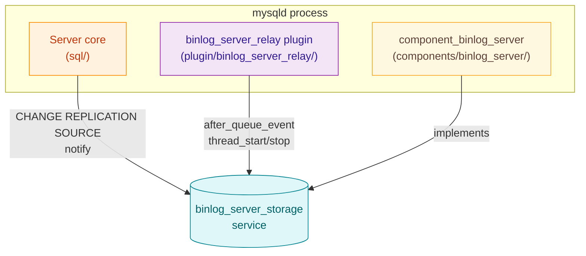
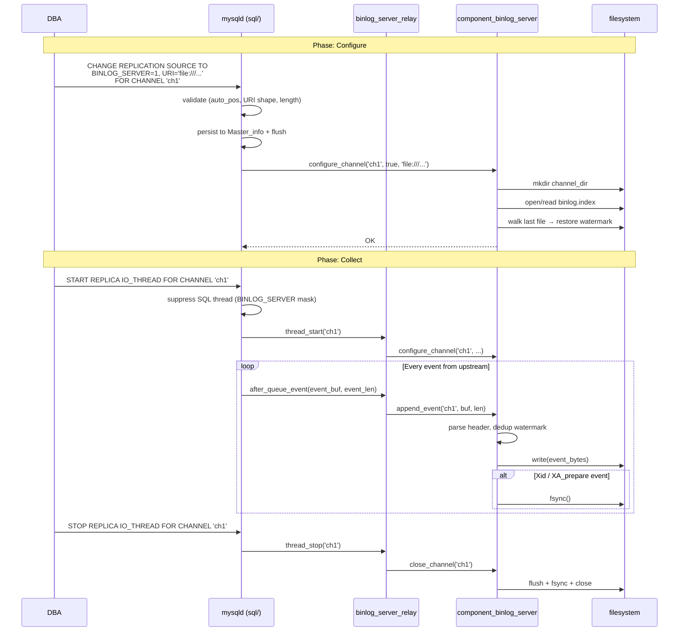
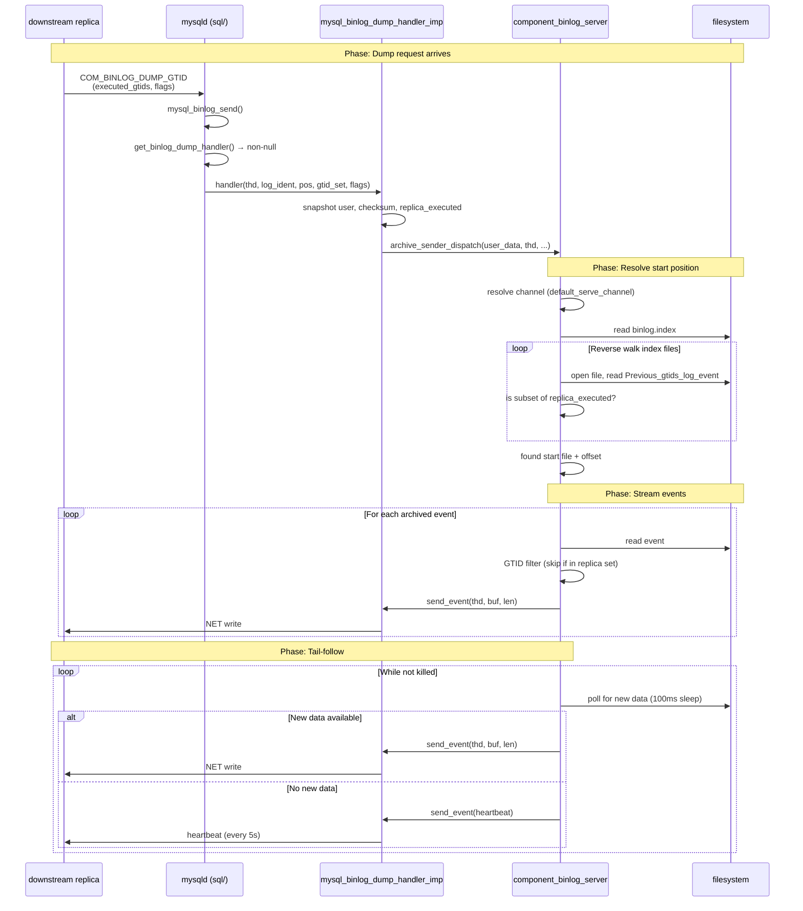
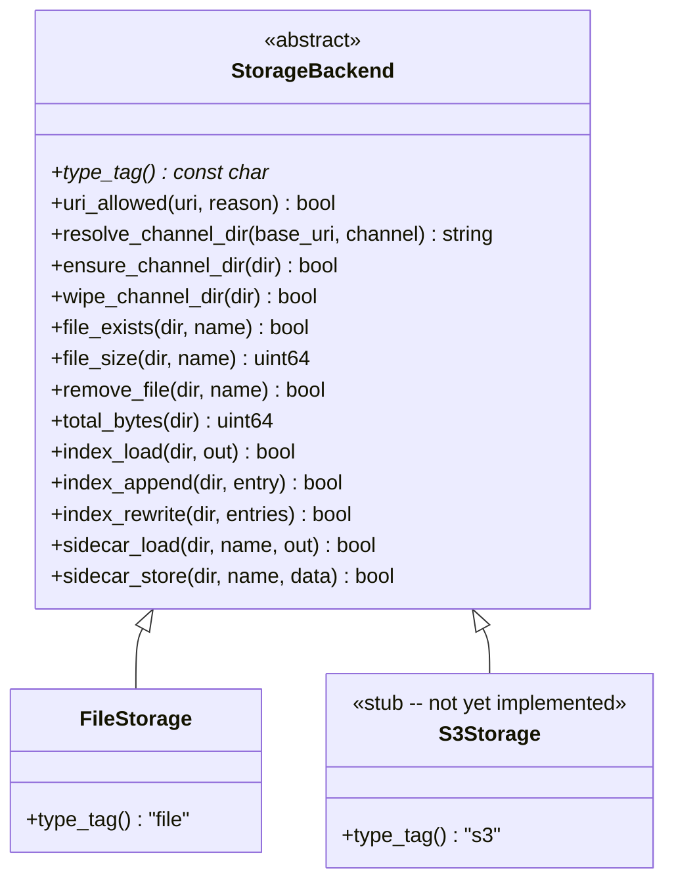
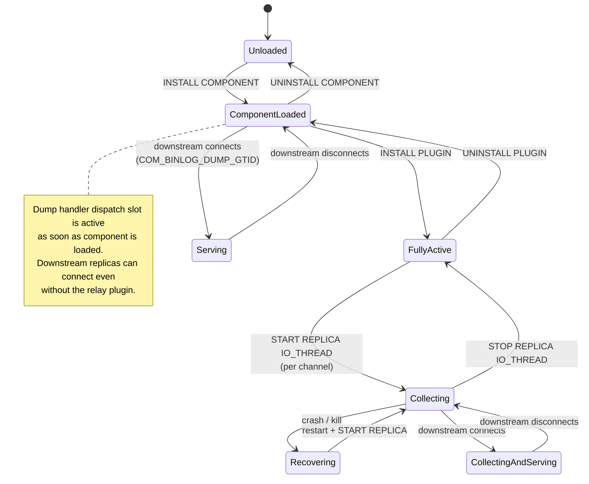
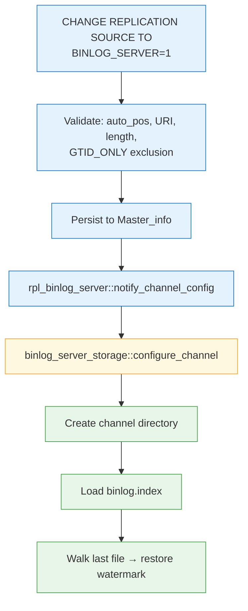
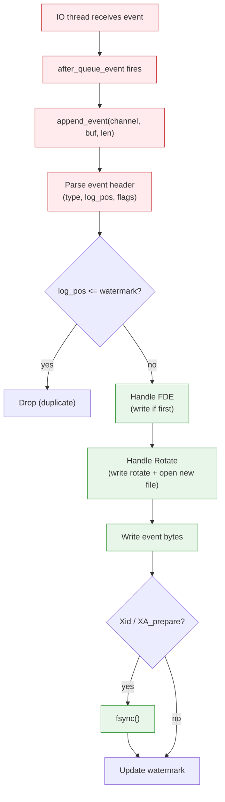
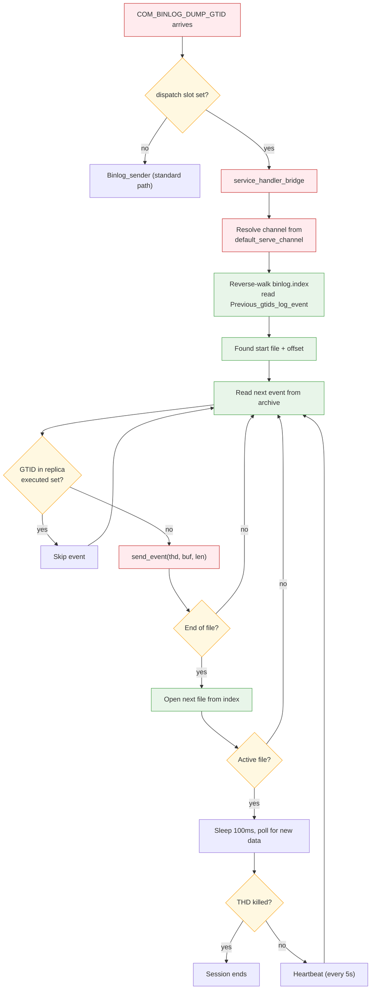

# Architecture

[&larr; Back to index](index.md) &middot;
[Overview](overview.md) &middot;
[User guide](user_guide.md) &middot;
**Architecture** &middot;
[Low-level design](design.md)

## Contents

- [Three pieces, one binary](#three-pieces-one-binary)
- [How it plugs into MySQL](#how-it-plugs-into-mysql)
  - [Integration points](#integration-points)
  - [Source tree layout](#source-tree-layout)
  - [Hook lifetimes](#hook-lifetimes)
  - [End-to-end sequence: configure &rarr; collect](#end-to-end-sequence-configure--collect)
  - [End-to-end sequence: serve to downstream](#end-to-end-sequence-serve-to-downstream)
  - [Component service ABI](#component-service-abi)
- [Storage backend abstraction](#storage-backend-abstraction)
- [Module map](#module-map)
- [Lifecycle](#lifecycle)
- [Data flow](#data-flow)
  - [Configure path](#configure-path)
  - [Collect path](#collect-path)
  - [Serve path](#serve-path)
- [Threading model](#threading-model)
- [Scalability characteristics](#scalability-characteristics)
- [Failure model](#failure-model)
- [Persistence and recovery](#persistence-and-recovery)

## Three pieces, one binary



| Piece | Type | Role |
| --- | --- | --- |
| Server core | Built into `mysqld` | Grammar extensions, `Master_info` persistence, channel validation, SQL-thread suppression, notify dispatch, dump handler dispatch slot. |
| `binlog_server_relay` | MySQL plugin (`.so`) | IO-thread observer. Intercepts every queued event and feeds bytes into the component via the service. |
| `component_binlog_server` | MySQL component (`.so`) | Storage and serving engine. Owns the on-disk archive, manages per-channel state, crash recovery, and serves archived events to downstream replicas. Publishes `binlog_server_storage` and acquires `mysql_binlog_dump_handler_register` + `mysql_binlog_dump_handler_io`. |

The server core is the **thinnest possible shim**: it adds two new
clauses to `CHANGE REPLICATION SOURCE`, persists them to
`mysql.slave_master_info`, suppresses the SQL thread for
BINLOG_SERVER channels, calls `binlog_server_storage::configure_channel`
at change-time, and provides the **dump handler dispatch slot** that
lets the component intercept `COM_BINLOG_DUMP_GTID` requests. It does
not know about files, directories, or binlog event formats.

## How it plugs into MySQL

### Integration points

| # | Hook | Where | What fires it |
| --- | --- | --- | --- |
| 1 | `CHANGE REPLICATION SOURCE` grammar | `sql/sql_yacc.yy`, `sql/lex.h` | DBA runs the SQL statement |
| 2 | `Master_info` persistence | `sql/rpl_mi.{h,cc}` | Write at `flush_info`, read at restart |
| 3 | SQL-thread suppression | `sql/rpl_replica.cc` | `start_slave_threads()` masks the SQL thread |
| 4 | Notify dispatch | `sql/rpl_binlog_server.{h,cc}` | `change_receive_options()` calls this |
| 5 | `Binlog_relay_IO_observer` | Plugin API | Server fires on IO-thread lifecycle and per-event |
| 6 | Dump handler dispatch slot | `sql/binlog_dump_handler.{h,cc}` | `mysql_binlog_send()` in `sql/rpl_source.cc` checks slot before `Binlog_sender` |
| 7 | `mysql_binlog_dump_handler_register` service | `sql/server_component/` | Component calls `install`/`uninstall` at init/deinit |
| 8 | `mysql_binlog_dump_handler_io` service | `sql/server_component/` | Component calls `send_event`/`flush` to push data to the dump connection |

### Source tree layout

```
percona-server/
├── sql/
│   ├── rpl_binlog_server.h           # notify function declarations
│   ├── rpl_binlog_server.cc          # acquires binlog_server_storage, calls configure/append
│   ├── rpl_mi.h / rpl_mi.cc         # Master_info + BINLOG_SERVER fields
│   ├── rpl_replica.cc               # SQL-thread suppression + validation
│   ├── rpl_source.cc                # dispatch check in mysql_binlog_send()
│   ├── binlog_dump_handler.h         # dispatch slot declaration
│   ├── binlog_dump_handler.cc        # atomic function pointer slot implementation
│   ├── sql_yacc.yy / lex.h          # grammar additions
│   └── sql_lex.h / sql_lex.cc       # LEX_SOURCE_INFO fields
│
├── sql/server_component/
│   ├── mysql_binlog_dump_handler_imp.h   # service bridge declarations
│   └── mysql_binlog_dump_handler_imp.cc  # install/uninstall + send_event/flush bridge
│
├── include/mysql/components/services/
│   ├── binlog_server_storage.h                       # collection service ABI
│   ├── mysql_binlog_dump_handler_register.h          # dump handler registration service ABI
│   ├── mysql_binlog_dump_handler_io.h                # dump handler I/O service ABI
│   └── bits/mysql_binlog_dump_handler_bits.h         # shared types (fn ptr, checksum enum)
│
├── plugin/binlog_server_relay/
│   ├── CMakeLists.txt
│   └── binlog_server_relay.cc        # Binlog_relay_IO_observer implementation
│
├── components/binlog_server/
│   ├── CMakeLists.txt
│   ├── binlog_server_component.cc    # component entry point (init/deinit)
│   ├── binlog_archive.h / .cc       # BinlogArchive + ChannelState (collection)
│   ├── archive_sender.h / .cc       # ArchiveSender + ArchiveDumpSession (serving)
│   ├── gtid_set.h / .cc             # component-local GTID set implementation
│   ├── server_services.h            # thin aliases for acquired server services
│   ├── storage_backend.h            # StorageBackend abstract interface (15 methods)
│   ├── file_storage.h / .cc         # FileStorage (file:// full implementation)
│   ├── s3_storage.h / .cc           # S3Storage (stub -- not yet implemented)
│   ├── gtid_renumberer.h / .cc      # GTID renumbering stub for rewrite mode
│   ├── log_helpers.h / .cc          # bslog / bslog_code logging wrappers
│   └── doc/                          # this documentation
│
├── scripts/
│   ├── mysql_system_tables.sql       # DDL for slave_master_info columns
│   └── mysql_system_tables_fix.sql   # ALTER for upgrades
│
├── share/
│   └── messages_to_error_log.txt     # ER_BINLOG_SERVER_* error codes
│
└── mysql-test/suite/binlog_server/   # MTR test suite
    ├── my.cnf
    ├── inc/
    │   ├── have_binlog_server.inc
    │   └── binlog_server_suppressions.inc
    ├── t/
    │   ├── basic_collect.test
    │   ├── multi_channel.test
    │   ├── resume_collection.test
    │   ├── syntax.test
    │   ├── binlog_server_chained.test         # Phase 2: 3-server chain
    │   ├── binlog_server_chained.cnf
    │   ├── binlog_server_multi_replica.test   # Phase 2: multi-downstream
    │   ├── binlog_server_multi_replica.cnf
    │   ├── binlog_server_xa_rotation.test     # Phase 2: XA + rotation + STOP suppression
    │   └── binlog_server_xa_rotation.cnf
    └── r/
        ├── basic_collect.result
        ├── multi_channel.result
        ├── resume_collection.result
        ├── syntax.result
        ├── binlog_server_chained.result
        ├── binlog_server_multi_replica.result
        └── binlog_server_xa_rotation.result
```

### Hook lifetimes

```mermaid
gantt
    title Hook activation timeline
    dateFormat X
    axisFormat %s

    section Server core
    Grammar available           :done, 0, 100
    Master_info persistence     :done, 0, 100
    SQL-thread suppression      :done, 0, 100
    Notify dispatch             :done, 0, 100

    section Component
    INSTALL COMPONENT           :crit, 10, 11
    binlog_server_storage live  :active, 11, 95
    UNINSTALL COMPONENT         :crit, 95, 96

    section Plugin
    INSTALL PLUGIN              :crit, 12, 13
    IO observer registered      :active, 13, 90
    UNINSTALL PLUGIN            :crit, 90, 91
```



The server-core hooks are always available (compiled in). The
component and plugin are dynamically loaded and can be loaded/unloaded
at runtime.

### End-to-end sequence: configure &rarr; collect



### End-to-end sequence: serve to downstream



### Component service ABI

The `binlog_server_storage` service is defined in
`include/mysql/components/services/binlog_server_storage.h`:

```c
BEGIN_SERVICE_DEFINITION(binlog_server_storage)
  DECLARE_METHOD(int, configure_channel,
    (const char *channel, bool enabled, const char *storage_uri));
  DECLARE_METHOD(int, append_event,
    (const char *channel, const unsigned char *buf, unsigned long len));
  DECLARE_METHOD(int, close_channel,
    (const char *channel));
END_SERVICE_DEFINITION(binlog_server_storage)
```

| Method | Called by | When |
| --- | --- | --- |
| `configure_channel` | Server notify + plugin `thread_start` | `CHANGE REPLICATION SOURCE` or IO-thread start |
| `append_event` | Plugin `after_queue_event` | Every binlog event received from the upstream |
| `close_channel` | Plugin `thread_stop` / `after_reset_slave` | IO thread stops or channel is reset |

The **dump handler services** are defined in
`include/mysql/components/services/mysql_binlog_dump_handler_register.h`
and `mysql_binlog_dump_handler_io.h`:

```c
BEGIN_SERVICE_DEFINITION(mysql_binlog_dump_handler_register)
  DECLARE_METHOD(int, install,
    (mysql_binlog_dump_handler_fn callback, void *user_data));
  DECLARE_METHOD(int, uninstall, ());
END_SERVICE_DEFINITION(mysql_binlog_dump_handler_register)

BEGIN_SERVICE_DEFINITION(mysql_binlog_dump_handler_io)
  DECLARE_METHOD(int, send_event,
    (MYSQL_THD thd, const unsigned char *buf, unsigned long len));
  DECLARE_METHOD(int, flush, (MYSQL_THD thd));
END_SERVICE_DEFINITION(mysql_binlog_dump_handler_io)
```

| Service | Method | Called by | When |
| --- | --- | --- | --- |
| `_register` | `install` | Component `init()` | Component loads; installs the dispatch callback |
| `_register` | `uninstall` | Component `deinit()` | Component unloads; clears the dispatch slot |
| `_io` | `send_event` | `ArchiveDumpSession` | Sends an event buffer to the dump connection's NET |
| `_io` | `flush` | `ArchiveDumpSession` | Flushes the NET write buffer |

### Additional services acquired (Phase 3)

| Service | Used by | Purpose |
| --- | --- | --- |
| `mysql_command_factory` | `user_channel_map_loader` | Open/close internal SQL session for table:// reads |
| `mysql_command_options` | `user_channel_map_loader` | Set protocol/user/host for the internal session |
| `mysql_command_query` | `user_channel_map_loader` | Execute SELECT against the mapping table |
| `mysql_command_query_result` | `user_channel_map_loader` | Retrieve result set rows |
| `mysql_command_field_info` | `user_channel_map_loader` | Verify column count of the mapping table |
| `mysql_command_error_info` | `user_channel_map_loader` | Surface SQL errors to the operator |
| `mysql_current_thread_reader` | `user_channel_map_loader` | Detect missing SQL context at startup |
| `udf_registration` | Component init/deinit | Register/unregister `binlog_server_reload_user_channel_map()` |

## Storage backend abstraction



`FileStorage` implements the full interface using `std::filesystem`.
`S3Storage` is a stub: it recognizes `s3://` URIs but all I/O methods
return failure with a logged message. The `BinlogArchive` dispatches
purge, index, and sidecar operations through the `StorageBackend`
interface, so adding new backends requires no changes to the binlog
protocol or purge logic.

## Module map

| Module | Responsibility | Key state |
| --- | --- | --- |
| `binlog_server_component.cc` | Component lifecycle (init/deinit), service registration, sysvar management, UDF registration | `log_bi`, `log_bs`, `sysvar_default_serve_channel` |
| `binlog_archive.{h,cc}` | Per-channel state management, event parsing, rotation, crash recovery, watermark, metadata tracking | `BinlogArchive` singleton, `ChannelState` map, `FileMetadata` map |
| `archive_sender.{h,cc}` | Dump handler dispatch, dump session lifecycle, GTID-based serving | `ArchiveSender` singleton, `ArchiveDumpSession` per connection |
| `pfs_status_table.{h,cc}` | PFS table: `replication_binlog_server_status` (per-channel counters) | Snapshot from `BinlogArchive::snapshot_status()` |
| `pfs_storage_table.{h,cc}` | PFS table: `replication_binlog_server_storage` (per-channel storage summary) | Snapshot from `BinlogArchive::snapshot_storage()` |
| `pfs_archive_table.{h,cc}` | PFS table: `replication_binlog_server_archive` (per-file metadata) | Snapshot from `BinlogArchive::snapshot_archive()` |
| `user_channel_map_loader.{h,cc}` | Parses inline CSV and `table://` URIs into a user&rarr;channel map | &mdash; |
| `gtid_set.{h,cc}` | Component-local GTID set: parsing, binary decode, interval management, subset checks | `binlog_server::gtid::Gtid_set` |
| `server_services.h` | Thin C++ aliases for acquired server services (`dump_handler_register`, `_io`, `thd_kill_handler`) | Service placeholders |
| `file_storage.{h,cc}` | File I/O abstraction for `file://` URIs: dir management, index, sidecars, remove | `std::filesystem` operations |
| `s3_storage.{h,cc}` | S3 storage stub (`s3://` URIs recognized but not implemented) | Returns failure with logged message |
| `gtid_renumberer.{h,cc}` | Logical-clock rewriter stub for archive rewrite mode (not yet active). Fixes `sequence_number`/`last_committed` when coalescing; GTID identifiers are never modified. | `rewrite::LogicalClockState` |
| `storage_backend.h` | Abstract interface for storage backends (15 virtual methods) | &mdash; |
| `log_helpers.{h,cc}` | Structured logging helpers (`bslog`, `bslog_code`) | &mdash; |

## Lifecycle



## Data flow

### Configure path



### Collect path



### Serve path



## Threading model

| Thread | What it does | Concurrency |
| --- | --- | --- |
| IO thread (per channel) | Receives events from upstream, fires observer callbacks | One per channel; each channel has its own `ChannelState` mutex |
| Client thread (DBA) | `CHANGE REPLICATION SOURCE` &rarr; `configure_channel` | Serialised by the channel's mutex |
| Dump thread (per downstream) | Handles a `COM_BINLOG_DUMP_GTID` connection; runs `ArchiveDumpSession` | One per connected downstream replica; independent file handles, no shared lock |

The component does not spawn its own background threads. Collection
work happens on the IO thread. Serving work happens on the dump thread
that MySQL creates for each replica connection. Configuration work
happens on the client thread.

## Scalability characteristics

| Dimension | Behaviour |
| --- | --- |
| **Channels** | Linear scaling. Each channel has its own mutex and file handles. No global lock. |
| **Throughput per channel** | Bounded by disk I/O. The `fsync` at transaction boundaries is the bottleneck; between Xid events, writes are buffered by the OS page cache. |
| **Downstream replicas** | Linear scaling. Each dump session has independent file handles. No shared lock between sessions. Disk reads are sequential within each session. |
| **Memory** | O(channels × index-size + dump-sessions × gtid-set-size). The in-memory index set is proportional to the number of binlog files per channel; each dump session holds a copy of the replica's GTID set for filtering. |
| **Disk** | Linear in event volume. One-to-one with the upstream's binlog byte volume. Serving is read-only on the archive. |

## Failure model

| Failure | Impact | Recovery |
| --- | --- | --- |
| **IO thread disconnect** | Collection pauses | `START REPLICA IO_THREAD` reconnects; GTID auto-position skips already-received events; watermark prevents archive duplicates |
| **Process crash** | Last partial event may be incomplete | Crash recovery truncates the partial tail and restores the watermark on next `configure_channel` |
| **Disk full** | `write()` or `fsync()` fails | Plugin logs the error; IO thread remains running but events are lost until space is freed. Manual intervention required. |
| **Component unloaded while collecting** | Plugin's service calls return failure | Plugin logs the failure and returns 0 (no IO-thread crash). Events are silently dropped until component is reloaded. |
| **Component unloaded while serving** | Dispatch slot is cleared (`uninstall`) | New dump requests fall through to the built-in `Binlog_sender`. In-flight dump sessions terminate gracefully (send_event returns error). |
| **Downstream replica disconnects** | Dump session thread detects NET error | Session ends cleanly; no impact on other sessions or collection. |
| **Downstream connects before archive exists** | `ArchiveSender` cannot resolve the channel directory | Returns `false` from dispatch; falls through to built-in `Binlog_sender` (which may also fail, producing a standard error). |
| **KILL on dump thread** | THD kill handler fires | `ArchiveDumpSession` detects killed state via `mysql_thd_kill_handler` service and exits the tail-follow loop. |

## Persistence and recovery

The on-disk state is:

```
<storage_uri>/<channel_name>/
├── binlog.index          # line-per-file, in rotation order
├── <source_binlog>.000001
├── <source_binlog>.000002
└── ...
```

Recovery algorithm (executed in `configure_channel`):

1. Parse `binlog.index` to populate the in-memory `indexed_files` set
   and `file_order` vector.
2. Open the last file in `file_order`.
3. Walk event-by-event from offset 4 (after the magic number):
   - Read the 19-byte common header.
   - Validate `event_length` against remaining file size.
   - If the event is an FDE, set `wrote_fde = true` and derive
     `has_checksum`.
   - Track `last_source_log_pos` from the event's `log_pos` field.
4. If the file ends with a partial event (not enough bytes for the
   declared `event_length`), truncate at the last complete event.
5. Set `last_source_log_pos` as the watermark. Subsequent appends
   with `log_pos <= watermark` will be dropped as duplicates.

This ensures the archive is always in a consistent state after any
crash, and collection resumes without gaps or duplicates.
