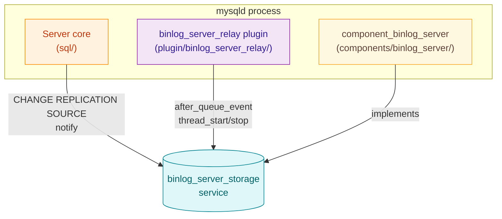
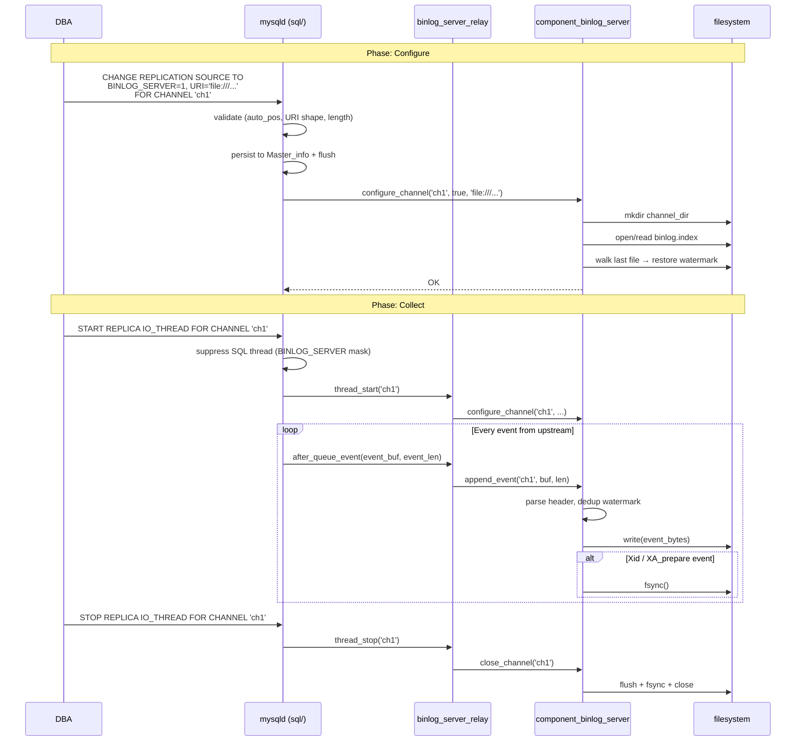
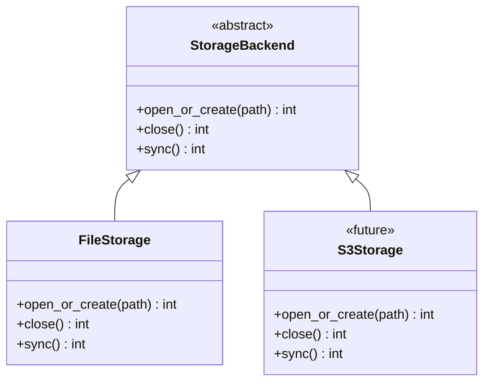
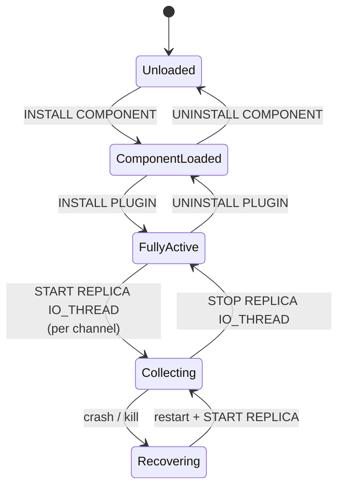
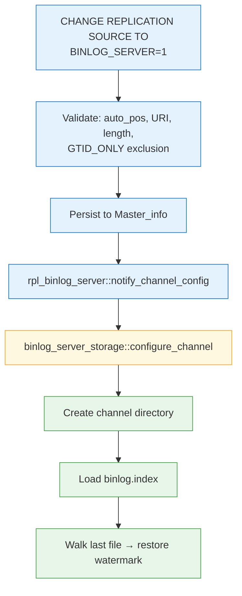
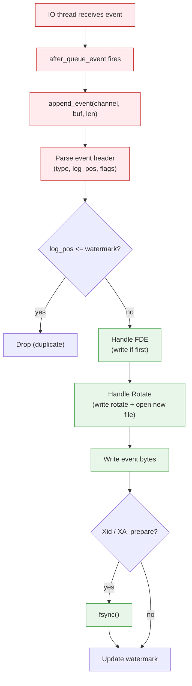

# Architecture

[&larr; Back to index](index.md) &middot;
[Overview](overview.md) &middot;
[User guide](user_guide.md) &middot;
**Architecture** &middot;
[Low-level design](design.md)

## Contents

- [Three pieces, one binary](#three-pieces-one-binary)
- [How it plugs into MySQL](#how-it-plugs-into-mysql)
  - [Integration points](#integration-points)
  - [Source tree layout](#source-tree-layout)
  - [Hook lifetimes](#hook-lifetimes)
  - [End-to-end sequence: configure &rarr; collect](#end-to-end-sequence-configure--collect)
  - [Component service ABI](#component-service-abi)
- [Storage backend abstraction](#storage-backend-abstraction)
- [Module map](#module-map)
- [Lifecycle](#lifecycle)
- [Data flow](#data-flow)
  - [Configure path](#configure-path)
  - [Collect path](#collect-path)
- [Threading model](#threading-model)
- [Scalability characteristics](#scalability-characteristics)
- [Failure model](#failure-model)
- [Persistence and recovery](#persistence-and-recovery)

## Three pieces, one binary



| Piece | Type | Role |
| --- | --- | --- |
| Server core | Built into `mysqld` | Grammar extensions, `Master_info` persistence, channel validation, SQL-thread suppression, notify dispatch. |
| `binlog_server_relay` | MySQL plugin (`.so`) | IO-thread observer. Intercepts every queued event and feeds bytes into the component via the service. |
| `component_binlog_server` | MySQL component (`.so`) | Storage engine. Owns the on-disk archive, manages per-channel state, crash recovery. Publishes the `binlog_server_storage` service. |

The server core is the **thinnest possible shim**: it adds two new
clauses to `CHANGE REPLICATION SOURCE`, persists them to
`mysql.slave_master_info`, suppresses the SQL thread for
BINLOG_SERVER channels, and calls `binlog_server_storage::configure_channel`
at change-time. It does not know about files, directories, or
binlog event formats.

## How it plugs into MySQL

### Integration points

| # | Hook | Where | What fires it |
| --- | --- | --- | --- |
| 1 | `CHANGE REPLICATION SOURCE` grammar | `sql/sql_yacc.yy`, `sql/lex.h` | DBA runs the SQL statement |
| 2 | `Master_info` persistence | `sql/rpl_mi.{h,cc}` | Write at `flush_info`, read at restart |
| 3 | SQL-thread suppression | `sql/rpl_replica.cc` | `start_slave_threads()` masks the SQL thread |
| 4 | Notify dispatch | `sql/rpl_binlog_server.{h,cc}` | `change_receive_options()` calls this |
| 5 | `Binlog_relay_IO_observer` | Plugin API | Server fires on IO-thread lifecycle and per-event |

### Source tree layout

```
percona-server/
├── sql/
│   ├── rpl_binlog_server.h           # notify function declarations
│   ├── rpl_binlog_server.cc          # acquires binlog_server_storage, calls configure/append
│   ├── rpl_mi.h / rpl_mi.cc         # Master_info + BINLOG_SERVER fields
│   ├── rpl_replica.cc               # SQL-thread suppression + validation
│   ├── sql_yacc.yy / lex.h          # grammar additions
│   └── sql_lex.h / sql_lex.cc       # LEX_SOURCE_INFO fields
│
├── include/mysql/components/services/
│   └── binlog_server_storage.h       # service ABI definition
│
├── plugin/binlog_server_relay/
│   ├── CMakeLists.txt
│   └── binlog_server_relay.cc        # Binlog_relay_IO_observer implementation
│
├── components/binlog_server/
│   ├── CMakeLists.txt
│   ├── binlog_server_component.cc    # component entry point (init/deinit)
│   ├── binlog_archive.h / .cc       # BinlogArchive + ChannelState
│   ├── storage_backend.h            # StorageBackend abstract interface
│   ├── file_storage.h / .cc         # FileStorage (file:// implementation)
│   ├── log_helpers.h / .cc          # bslog / bslog_code logging wrappers
│   └── doc/                          # this documentation
│
├── scripts/
│   ├── mysql_system_tables.sql       # DDL for slave_master_info columns
│   └── mysql_system_tables_fix.sql   # ALTER for upgrades
│
├── share/
│   └── messages_to_error_log.txt     # ER_BINLOG_SERVER_* error codes
│
└── mysql-test/suite/binlog_server/   # MTR test suite
    ├── my.cnf
    ├── inc/
    │   ├── have_binlog_server.inc
    │   └── binlog_server_suppressions.inc
    ├── t/
    │   ├── basic_collect.test
    │   ├── multi_channel.test
    │   ├── resume_collection.test
    │   └── syntax.test
    └── r/
        ├── basic_collect.result
        ├── multi_channel.result
        ├── resume_collection.result
        └── syntax.result
```

### Hook lifetimes

```mermaid
gantt
    title Hook activation timeline
    dateFormat X
    axisFormat %s

    section Server core
    Grammar available           :done, 0, 100
    Master_info persistence     :done, 0, 100
    SQL-thread suppression      :done, 0, 100
    Notify dispatch             :done, 0, 100

    section Component
    INSTALL COMPONENT           :crit, 10, 11
    binlog_server_storage live  :active, 11, 95
    UNINSTALL COMPONENT         :crit, 95, 96

    section Plugin
    INSTALL PLUGIN              :crit, 12, 13
    IO observer registered      :active, 13, 90
    UNINSTALL PLUGIN            :crit, 90, 91
```



The server-core hooks are always available (compiled in). The
component and plugin are dynamically loaded and can be loaded/unloaded
at runtime.

### End-to-end sequence: configure &rarr; collect



### Component service ABI

The `binlog_server_storage` service is defined in
`include/mysql/components/services/binlog_server_storage.h`:

```c
BEGIN_SERVICE_DEFINITION(binlog_server_storage)
  DECLARE_METHOD(int, configure_channel,
    (const char *channel, bool enabled, const char *storage_uri));
  DECLARE_METHOD(int, append_event,
    (const char *channel, const unsigned char *buf, unsigned long len));
  DECLARE_METHOD(int, close_channel,
    (const char *channel));
END_SERVICE_DEFINITION(binlog_server_storage)
```

| Method | Called by | When |
| --- | --- | --- |
| `configure_channel` | Server notify + plugin `thread_start` | `CHANGE REPLICATION SOURCE` or IO-thread start |
| `append_event` | Plugin `after_queue_event` | Every binlog event received from the upstream |
| `close_channel` | Plugin `thread_stop` / `after_reset_slave` | IO thread stops or channel is reset |

## Storage backend abstraction



Phase 1 implements `FileStorage` only. The `S3Storage` backend is a
placeholder for future phases. The `BinlogArchive` dispatches every
I/O operation through the `StorageBackend` interface, so adding new
backends requires no changes to the binlog protocol logic.

## Module map

| Module | Responsibility | Key state |
| --- | --- | --- |
| `binlog_server_component.cc` | Component lifecycle (init/deinit), service registration | `log_bi`, `log_bs` |
| `binlog_archive.{h,cc}` | Per-channel state management, event parsing, rotation, crash recovery, watermark | `BinlogArchive` singleton, `ChannelState` map |
| `file_storage.{h,cc}` | File I/O abstraction for `file://` URIs | Directory creation, path management |
| `storage_backend.h` | Abstract interface for storage backends | &mdash; |
| `log_helpers.{h,cc}` | Structured logging helpers (`bslog`, `bslog_code`) | &mdash; |

## Lifecycle



## Data flow

### Configure path



### Collect path



## Threading model

| Thread | What it does | Concurrency |
| --- | --- | --- |
| IO thread (per channel) | Receives events from upstream, fires observer callbacks | One per channel; each channel has its own `ChannelState` mutex |
| Client thread (DBA) | `CHANGE REPLICATION SOURCE` &rarr; `configure_channel` | Serialised by the channel's mutex |

There is no background thread owned by the component. All work happens
on the IO thread or the client thread that issues configuration
statements. This means the component adds zero new threads to the
server.

## Scalability characteristics

| Dimension | Behaviour |
| --- | --- |
| **Channels** | Linear scaling. Each channel has its own mutex and file handles. No global lock. |
| **Throughput per channel** | Bounded by disk I/O. The `fsync` at transaction boundaries is the bottleneck; between Xid events, writes are buffered by the OS page cache. |
| **Memory** | O(channels × index-size). The in-memory index set (`std::set<std::string>`) is proportional to the number of binlog files per channel. |
| **Disk** | Linear in event volume. One-to-one with the upstream's binlog byte volume. |

## Failure model

| Failure | Impact | Recovery |
| --- | --- | --- |
| **IO thread disconnect** | Collection pauses | `START REPLICA IO_THREAD` reconnects; GTID auto-position skips already-received events; watermark prevents archive duplicates |
| **Process crash** | Last partial event may be incomplete | Crash recovery truncates the partial tail and restores the watermark on next `configure_channel` |
| **Disk full** | `write()` or `fsync()` fails | Plugin logs the error; IO thread remains running but events are lost until space is freed. Manual intervention required. |
| **Component unloaded while collecting** | Plugin's service calls return failure | Plugin logs the failure and returns 0 (no IO-thread crash). Events are silently dropped until component is reloaded. |

## Persistence and recovery

The on-disk state is:

```
<storage_uri>/<channel_name>/
├── binlog.index          # line-per-file, in rotation order
├── <source_binlog>.000001
├── <source_binlog>.000002
└── ...
```

Recovery algorithm (executed in `configure_channel`):

1. Parse `binlog.index` to populate the in-memory `indexed_files` set
   and `file_order` vector.
2. Open the last file in `file_order`.
3. Walk event-by-event from offset 4 (after the magic number):
   - Read the 19-byte common header.
   - Validate `event_length` against remaining file size.
   - If the event is an FDE, set `wrote_fde = true` and derive
     `has_checksum`.
   - Track `last_source_log_pos` from the event's `log_pos` field.
4. If the file ends with a partial event (not enough bytes for the
   declared `event_length`), truncate at the last complete event.
5. Set `last_source_log_pos` as the watermark. Subsequent appends
   with `log_pos <= watermark` will be dropped as duplicates.

This ensures the archive is always in a consistent state after any
crash, and collection resumes without gaps or duplicates.
