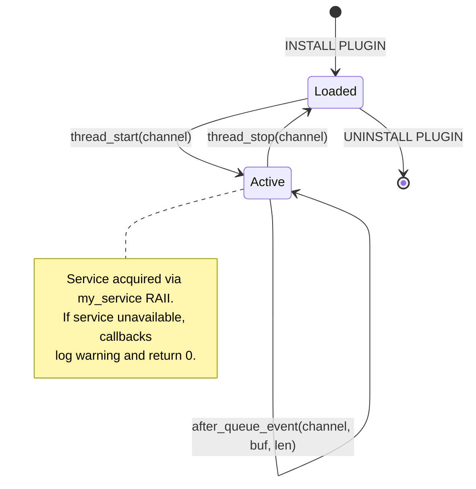

# Low-level design

[&larr; Back to index](index.md) &middot;
[Overview](overview.md) &middot;
[User guide](user_guide.md) &middot;
[Architecture](architecture.md) &middot;
**Low-level design**

## Contents

- [Source map](#source-map)
- [Locking discipline](#locking-discipline)
- [ChannelState anatomy](#channelstate-anatomy)
- [On-disk archive format](#on-disk-archive-format)
- [Append path](#append-path)
- [Deduplication watermark](#deduplication-watermark)
- [Durability boundaries](#durability-boundaries)
- [Crash recovery](#crash-recovery)
- [Rotate handling](#rotate-handling)
- [FDE handling](#fde-handling)
- [Index management](#index-management)
- [Sanitize binlog name](#sanitize-binlog-name)
- [Observer plugin lifecycle](#observer-plugin-lifecycle)
- [Configure-time notify path](#configure-time-notify-path)
- [Dump handler dispatch slot](#dump-handler-dispatch-slot)
- [ArchiveSender and ArchiveDumpSession](#archivesender-and-archivedumpsession)
- [Component-local GTID set](#component-local-gtid-set)
- [Serve path: GTID position resolution](#serve-path-gtid-position-resolution)
- [Serve path: event streaming and filtering](#serve-path-event-streaming-and-filtering)
- [Serve path: tail-follow and heartbeat](#serve-path-tail-follow-and-heartbeat)
- [Error code catalogue](#error-code-catalogue)
- [Build wiring](#build-wiring)

## Source map

| File | Role |
| --- | --- |
| `components/binlog_server/binlog_server_component.cc` | Component entry point. Publishes `binlog_server_storage` service, acquires logging + dump handler services, registers sysvars. |
| `components/binlog_server/binlog_archive.h` | Declares `BinlogArchive` (singleton), `ChannelState` (per-channel), and all protocol methods. |
| `components/binlog_server/binlog_archive.cc` | Implements configure, append, close, crash recovery, rotation, deduplication. |
| `components/binlog_server/archive_sender.h` | Declares `ArchiveSender` singleton, `UserChannelMap`, dispatch callback. |
| `components/binlog_server/archive_sender.cc` | Implements `ArchiveSender`, `ArchiveDumpSession` (GTID resolution, event streaming, tail-follow). |
| `components/binlog_server/gtid_set.h` | Declares `binlog_server::gtid::Gtid_set` (component-local GTID implementation). |
| `components/binlog_server/gtid_set.cc` | Implements GTID text parsing, binary decoding, interval management, subset checks. |
| `components/binlog_server/server_services.h` | Thin C++ aliases for `mysql_binlog_dump_handler_register`, `_io`, `mysql_thd_kill_handler`. |
| `components/binlog_server/storage_backend.h` | Abstract `StorageBackend` interface. |
| `components/binlog_server/file_storage.h` | `FileStorage` &mdash; concrete backend for `file://` URIs. |
| `components/binlog_server/file_storage.cc` | Directory creation, path resolution. |
| `components/binlog_server/log_helpers.h` | `bslog()`, `bslog_code()` declarations. |
| `components/binlog_server/log_helpers.cc` | Logging implementation using `LogComponentErr`. |
| `plugin/binlog_server_relay/binlog_server_relay.cc` | Plugin: `Binlog_relay_IO_observer` callbacks, RAII service acquisition. |
| `sql/rpl_binlog_server.h` | Notify function declarations + URI shape validator. |
| `sql/rpl_binlog_server.cc` | Service acquisition, `binlog_server_notify_channel_config()`. |
| `sql/binlog_dump_handler.h` | Declares `set_binlog_dump_handler()`, `get_binlog_dump_handler()`, typedef. |
| `sql/binlog_dump_handler.cc` | Atomic function pointer slot implementation. |
| `sql/server_component/mysql_binlog_dump_handler_imp.h` | Declares service bridge classes. |
| `sql/server_component/mysql_binlog_dump_handler_imp.cc` | Implements `install`/`uninstall`, `send_event`/`flush`, `service_handler_bridge`. |
| `include/mysql/components/services/binlog_server_storage.h` | Collection service ABI (`configure_channel`, `append_event`, `close_channel`). |
| `include/mysql/components/services/mysql_binlog_dump_handler_register.h` | Dump handler registration service ABI (`install`, `uninstall`). |
| `include/mysql/components/services/mysql_binlog_dump_handler_io.h` | Dump handler I/O service ABI (`send_event`, `flush`). |
| `include/mysql/components/services/bits/mysql_binlog_dump_handler_bits.h` | Shared types: `mysql_binlog_dump_handler_fn`, checksum enum. |

## Locking discipline

```
Global:
  No global lock. BinlogArchive's channel map is protected by its
  own mutex (channel_map_mutex_), but only for map
  insert / lookup / erase operations.

Per-channel:
  Each ChannelState has its own std::mutex (mtx). All operations on
  a channel (configure, append, close, rotate) hold this mutex for
  the duration of the call.

Lock ordering:
  channel_map_mutex_ → ChannelState::mtx

  Never hold two ChannelState mutexes simultaneously.
  Never hold ChannelState::mtx while acquiring channel_map_mutex_.
```

The single-mutex-per-channel design means channels cannot deadlock
against each other, and the IO thread (which is per-channel) never
contends with IO threads of other channels.

## ChannelState anatomy

```cpp
struct ChannelState {
  std::mutex mtx;

  // On-disk I/O
  std::ofstream out;
  int fsync_fd = -1;

  // Current file tracking
  std::string current_log_name;
  std::string base_dir;

  // Watermark
  uint64_t last_source_log_pos = 0;

  // Protocol state
  bool wrote_fde = false;
  bool has_checksum = false;

  // Counters
  uint64_t events_appended = 0;
  uint64_t bytes_appended = 0;

  // Index state
  bool index_loaded = false;
  std::set<std::string> indexed_files;
  std::vector<std::string> file_order;
};
```

Key invariants:

- `out.is_open()` iff we are actively collecting into a file.
- `fsync_fd` is a POSIX fd opened on the same path, used exclusively
  for `fsync(2)` calls (the `std::ofstream` doesn't expose its fd).
- `current_log_name` is the basename (e.g. `binlog.000003`), not a
  full path.
- `last_source_log_pos` is always the `log_pos` of the last
  fully-written event in the current file. Zero means no events
  written yet.
- `wrote_fde` is reset on every file rotation. It prevents writing
  a second FDE if the upstream re-sends one on reconnect within the
  same file.

## On-disk archive format

Each archived file is a **byte-identical copy** of the source's binlog
file, starting from the 4-byte magic number (`\xfebin`) through the
last event appended:

```
Offset 0:    fe 62 69 6e              (magic: "\xfebin")
Offset 4:    [FDE - 119+ bytes]       (Format Description Event)
Offset ...:  [event] [event] ...      (data events, in source order)
Offset EOF:  [Rotate event]           (written at file close/rotation)
```

Each event has the standard 19-byte common header:

```
Bytes 0-3:   timestamp (4 bytes, little-endian)
Byte  4:     type_code (1 byte)
Bytes 5-8:   server_id (4 bytes, little-endian)
Bytes 9-12:  event_length (4 bytes, little-endian)
Bytes 13-16: log_pos (4 bytes, little-endian, next event position)
Bytes 17-18: flags (2 bytes, little-endian)
```

If `has_checksum` is true, each event has a 4-byte CRC32 appended
after the declared `event_length - 4` payload bytes.

## Append path

The `append_event` method is the hot path, called once per event by
the IO thread:

```
append_event(channel, buf, len):
  1. Lock ChannelState::mtx
  2. Parse 19-byte header → type_code, event_length, log_pos
  3. Deduplication: if log_pos > 0 && log_pos <= last_source_log_pos → drop
  4. Switch on type_code:
     - FORMAT_DESCRIPTION_EVENT → handle_format_description_event()
     - ROTATE_EVENT → handle_rotate_event()
     - other → write raw bytes
  5. Update watermark: last_source_log_pos = log_pos
  6. Increment counters
  7. If type_code == XID_EVENT || type_code == XA_PREPARE_LOG_EVENT:
     → sync_channel_to_disk()
```

## Deduplication watermark

The watermark is `last_source_log_pos` &mdash; the byte offset in the
source's binlog where the next event would start. Because GTID-based
auto-position can re-deliver events that were already received before
a disconnect:

- If `log_pos == 0`: the event is a pseudo-event (e.g. heartbeat or
  artificial rotate) and is always processed.
- If `log_pos > 0 && log_pos <= last_source_log_pos`: the event is a
  duplicate. Drop it.
- If `log_pos > last_source_log_pos`: new event. Append it.

The watermark is reset to 0 on file rotation (new source file means
new offset space). It is persisted indirectly: on crash recovery,
it is re-derived by walking the last file.

## Durability boundaries

```
Event types that trigger fsync:
  - XID_EVENT (33)           → committed transaction
  - XA_PREPARE_LOG_EVENT (38) → XA prepare

Event types that trigger flush + fsync + close:
  - Rotate (explicit)        → close current file, fsync, open new
  - close_channel()          → IO thread stopping
```

Between transaction boundaries, writes are buffered by the OS page
cache. This trades a small window of potential data loss (events
since the last Xid) for significantly better throughput.

The `fsync_fd` trick: we open a second POSIX file descriptor on the
same path (read-only) specifically for `fsync(2)`, because
`std::ofstream` does not expose its internal fd. The `ofstream::flush()`
ensures data reaches the kernel buffer; `::fsync(fsync_fd)` ensures it
reaches stable storage.

## Crash recovery

Executed in `configure_channel` → `recover_state_from_archive`:

```
recover_state_from_archive(ChannelState &cs):
  1. Read binlog.index line by line → populate indexed_files, file_order
  2. If file_order is empty → fresh channel, return
  3. last_file = file_order.back()
  4. Open last_file for reading
  5. Skip 4-byte magic
  6. last_good_offset = 4
  7. Loop:
     a. Read 19-byte header
     b. If < 19 bytes available → partial header → break
     c. Extract event_length from header
     d. If offset + event_length > file_size → partial event → break
     e. If type == FDE → wrote_fde = true, derive has_checksum
     f. last_source_log_pos = header.log_pos
     g. last_good_offset = offset + event_length
     h. Advance offset
  8. If last_good_offset < file_size:
     → truncate file to last_good_offset
     → log warning about truncated partial tail
  9. Set cs.last_source_log_pos, cs.wrote_fde, cs.has_checksum
```

## Rotate handling

When a `ROTATE_EVENT` arrives from the upstream:

```
handle_rotate_event(ChannelState &cs, buf, len):
  1. Extract new filename from event payload
  2. sanitize_binlog_name(new_name, has_checksum || !wrote_fde)
  3. If new_name == current_log_name && file is open → no-op (same file)
  4. If new_name == current_log_name && file is closed → reopen
  5. Otherwise:
     a. Write a real Rotate event to current file (marks EOF)
     b. Flush + fsync + close current file
     c. Reset: last_source_log_pos = 0, wrote_fde = false
     d. Open new file, write 4-byte magic
     e. Add new file to index (if not already present)
     f. Update current_log_name
```

The "write a real Rotate event" step ensures every archived file
ends with a proper Rotate event pointing to the next file, just like
the source's original binlog files do.

## FDE handling

The Format Description Event is special:

```
handle_format_description_event(ChannelState &cs, buf, len):
  1. If cs.wrote_fde → drop (duplicate, reconnect within same file)
  2. Derive has_checksum from FDE payload (byte at specific offset)
  3. Write event bytes to file
  4. cs.wrote_fde = true
  5. cs.has_checksum = (derived value)
```

The `wrote_fde` flag prevents writing a second FDE if the IO thread
reconnects to the upstream within the lifetime of the same archive
file. Since the FDE is always the first real event after the magic
number, a duplicate would corrupt the file.

## Index management

The `binlog.index` file is a simple text file with one filename per
line, in rotation order:

```
./binlog.000001
./binlog.000002
./binlog.000003
```

Management rules:

- **Load:** On `configure_channel`, read all lines into `indexed_files`
  (set, for O(1) lookup) and `file_order` (vector, preserves order).
- **Add:** On rotate to a new file, append the filename only if it is
  not already in `indexed_files`. This makes the operation idempotent
  across reconnects.
- **Never remove:** Phase 1 does not implement purging. Files
  accumulate until manually deleted.

## Sanitize binlog name

The source may send Rotate events with a CRC32 checksum appended to
the payload. The `sanitize_binlog_name` function strips those trailing
4 bytes when appropriate:

```
sanitize_binlog_name(name, assume_checksum):
  If assume_checksum && name.size() > 4:
    Strip last 4 bytes (they are the CRC32, not part of the filename)
  Also strip any directory prefix (e.g. "./")
  Return the clean basename
```

The `assume_checksum` parameter is `true` when either `has_checksum`
is set or `wrote_fde` is still false (meaning we haven't yet seen the
FDE that tells us the checksum algorithm, so we assume the worst case).

## Observer plugin lifecycle



Plugin callbacks and their behaviour:

| Callback | Action | Return |
| --- | --- | --- |
| `thread_start` | Call `configure_channel(ch, true, uri)` | Always 0 |
| `after_queue_event` | Call `append_event(ch, buf, len)` | Always 0 |
| `thread_stop` | Call `close_channel(ch)` | Always 0 |
| `after_reset_slave` | Call `close_channel(ch)` | Always 0 |

All callbacks return 0 regardless of the service call result. This
prevents binlog-server failures from crashing or stalling the IO
thread. Errors are logged via the error log with stable error codes.

## Configure-time notify path

When `CHANGE REPLICATION SOURCE TO ... BINLOG_SERVER=1` is executed:

```
change_receive_options() [sql/rpl_replica.cc]
  → binlog_server_notify_channel_config() [sql/rpl_binlog_server.cc]
    → acquire binlog_server_storage service (dynamic, may fail if not loaded)
    → service->configure_channel(channel_name, enabled, storage_uri)
    → release service
```

If the component is not loaded, the notify call logs a warning
(`ER_BINLOG_SERVER_SERVICE_UNAVAILABLE`) and returns. The channel
configuration is still persisted to `Master_info`; when the component
is loaded later, the next `thread_start` will trigger
`configure_channel` again.

## Dump handler dispatch slot

The dispatch slot is a **two-layer atomic** mechanism:

### Layer 1: Internal slot (`sql/binlog_dump_handler.{h,cc}`)

```cpp
static std::atomic<Binlog_dump_handler_func> g_binlog_dump_handler{nullptr};

void set_binlog_dump_handler(Binlog_dump_handler_func f) {
  g_binlog_dump_handler.store(f, std::memory_order_release);
}

Binlog_dump_handler_func get_binlog_dump_handler() {
  return g_binlog_dump_handler.load(std::memory_order_acquire);
}
```

The internal function pointer type:

```cpp
using Binlog_dump_handler_func = bool (*)(THD *thd, const char *log_ident,
                                          my_off_t pos, Gtid_set *gtid_set,
                                          uint32 flags);
```

### Layer 2: Service bridge (`sql/server_component/mysql_binlog_dump_handler_imp.cc`)

The service bridge translates between the internal slot and the
component's callback signature:

```
install(callback, user_data):
  1. Store callback + user_data in file-static variables
  2. set_binlog_dump_handler(&service_handler_bridge)

uninstall():
  1. set_binlog_dump_handler(nullptr)
  2. Clear callback + user_data

service_handler_bridge(thd, log_ident, pos, gtid_set, flags):
  1. snapshot_user(thd)          → capture replica_user from THD
  2. snapshot_checksum(thd)      → read negotiated checksum from user variable
  3. snapshot_replica_executed() → serialize gtid_set to text
  4. Call stored callback(user_data, thd, log_ident, pos, gtid_text,
                          flags, server_id, replica_server_id, checksum, user)
```

### Dispatch site (`sql/rpl_source.cc`)

```cpp
// In mysql_binlog_send(), before constructing Binlog_sender:
if (auto handler = get_binlog_dump_handler(); handler != nullptr) {
  if (handler(thd, log_ident, pos, gtid_set, flags))
    return;
}
// ... standard Binlog_sender path ...
```

If the handler returns `true`, the dump request was fully served by
the component and the function returns without touching `Binlog_sender`.
If it returns `false`, the request falls through to the built-in path.

## ArchiveSender and ArchiveDumpSession

### ArchiveSender (singleton)

- Holds a pointer to `BinlogArchive` (set at component init).
- Holds the `default_serve_channel` string (updated via sysvar callback).
- The `dispatch()` method is the callback installed into the dump handler slot.

### ArchiveDumpSession (per connection)

Created on the dump thread when a `COM_BINLOG_DUMP_GTID` request
arrives and the dispatch slot fires. Lifetime is exactly one dump
request.

Key state:

```cpp
class ArchiveDumpSession {
  MYSQL_THD thd_;
  std::string channel_;
  std::string base_dir_;
  binlog_server::gtid::Gtid_set replica_executed_;
  uint32_t source_server_id_;
  uint32_t replica_server_id_;
  mysql_binlog_dump_handler_checksum_alg checksum_alg_;
  std::vector<std::string> index_files_;  // from binlog.index
  std::ifstream file_;                    // current read position
};
```

Key methods:

- `run()` — orchestrates the full dump lifecycle
- `resolve_start_position()` — reverse-walks index using GTID set
- `stream_file()` — reads events from one archive file, filters, sends
- `tail_follow()` — polls active file for new data, sends heartbeats

## Component-local GTID set

The component cannot use the server's `Gtid_set` class (it is part
of the server core, not exported as a service). Instead, a self-contained
implementation lives in `gtid_set.{h,cc}`:

```cpp
namespace binlog_server::gtid {

class Gtid_set {
 public:
  bool parse_text(const char *text);
  bool decode_previous_gtids_event(const uint8_t *payload, size_t len);
  bool contains(const std::string &uuid, uint64_t gno) const;
  bool is_subset_of(const Gtid_set &super) const;
  void add(const std::string &uuid, uint64_t gno);
  std::string to_string() const;

 private:
  // uuid → sorted vector of [start, end) intervals
  std::map<std::string, std::vector<std::pair<uint64_t, uint64_t>>> sets_;
};

}  // namespace binlog_server::gtid
```

Design decisions:

- **Text parsing** handles the standard `uuid:interval[:interval][,...]`
  format that MySQL uses in `SHOW MASTER STATUS` and
  `Executed_Gtid_Set`.
- **Binary decoding** reads `Previous_gtids_log_event` payloads
  (the on-disk format: `n_sids` followed by `{uuid, n_intervals,
  intervals[]}` tuples).
- **Interval merging** is performed on `add()` to keep the set compact.
- **Subset check** is used during reverse-walk to determine the start
  file.
- **Contains check** is used per-event to decide whether to skip a
  GTID-tagged transaction group.

## Serve path: GTID position resolution

```
resolve_start_position():
  1. Read binlog.index → populate index_files_ (ordered)
  2. For i = index_files_.size()-1 downto 0:
     a. Open index_files_[i]
     b. Skip 4-byte magic, read FDE
     c. Read Previous_gtids_log_event (type 35, always second event)
     d. Decode into a Gtid_set (file_previous_gtids)
     e. If file_previous_gtids.is_subset_of(replica_executed_):
        → this file is the start point (all prior GTIDs are already
          applied; this file may contain new ones)
        → break
  3. If no file found: start from the very first file in the index
  4. Open the start file, position after FDE
```

This mirrors the standard MySQL algorithm for GTID AUTO_POSITION, but
operates on the archive's `Previous_gtids_log_event` rather than the
server's own binlog.

## Serve path: event streaming and filtering

```
send_event_loop():
  Loop (while not killed):
     a. Read 19-byte event header
     b. If not enough bytes → EOF handling (see tail-follow)
     c. If event_len < 19 → log corrupt header error, abort session
     d. Read full event (event_length bytes)
     e. should_skip_event() check:
        - Artificial flag (0x20) → skip
        - FDE (type 15) → skip (already shipped)
        - STOP (type 3) on non-active file → skip (suppress mid-archive)
        - Heartbeat v1/v2 (type 27/41) → skip (upstream heartbeats)
        - GTID (type 33/42): check replica_executed_.contains(uuid, gno)
          → if yes: set skip_group = true
        - If skip_group: skip event; reset on XID (16) or XA_PREPARE (38)
     f. If skipped: increment counter + maybe_send_idle_heartbeat()
        (sends heartbeat if heartbeat_period elapsed since last sent event,
        preventing replica timeout during long skip runs)
     g. send_event(thd_, event_buf, event_len)
        - On failure: log type/len/file/pos, abort session
     h. On real ROTATE: advance to next index file, ship new FDE
```

## Serve path: tail-follow and heartbeat

When the dump session reaches the last (active) file in the index and
exhausts all currently-written data:

```
wait_for_more_data():
  deadline = now() + heartbeat_period (5s)
  Loop (until deadline):
    1. Check if THD is killed → return false (abort)
    2. Re-stat file → if size > current_pos → return true (data ready)
    3. Refresh index → if next file appeared → return true
    4. Sleep 100ms
  Return true (no data, caller sends heartbeat)

On EOF in send_event_loop():
  If BINLOG_DUMP_NON_BLOCK flag set → return (session ends cleanly)
  Otherwise → wait_for_more_data() + send heartbeat
```

### Heartbeat version selection

The session inspects the dump request flags:

- `USE_HEARTBEAT_EVENT_V2` (bit 1) set → emit type 41 (Heartbeat v2)
  with length-prefixed log filename in payload
- Otherwise → emit type 27 (Heartbeat v1) with raw filename bytes

Both carry `log_pos = current_pos` and CRC32 if `m_has_checksum`.

### BINLOG_DUMP_NON_BLOCK

When the `BINLOG_DUMP_NON_BLOCK` flag (bit 0) is set in the dump
request, the session returns successfully when it reaches the end of
available data instead of tail-following. This is the mode used by
`mysqlbinlog --read-from-remote-server`.

### Idle heartbeats during event skipping

When the GTID filter is skipping a long run of already-applied
transactions, `maybe_send_idle_heartbeat()` is called after each
skipped event. If `heartbeat_period` (5s) has elapsed since the last
event was sent to the replica, a heartbeat is emitted. This prevents
the replica from timing out its connection during large skip runs
(e.g., a fresh replica with an empty executed set connecting to an
archive where most GTIDs are already applied from a prior lifecycle).

The `mysql_thd_kill_handler` service is used to register a callback
on the THD so that `KILL <connection_id>` or server shutdown
immediately sets a flag that the tail-follow loop checks.

## Error code catalogue

| Code | Symbol | Level | Message |
| --- | --- | --- | --- |
| 48350 | `ER_BINLOG_SERVER_CHANNEL_CONFIGURED` | Note | Binlog server channel '%s' configured with storage URI '%s' |
| 48351 | `ER_BINLOG_SERVER_IO_ERROR` | Error | Binlog server I/O error on channel '%s': %s |
| 48352 | `ER_BINLOG_SERVER_CONFIG_REJECTED` | Error | Binlog server configuration rejected for channel '%s': %s |
| 48353 | `ER_BINLOG_SERVER_RECOVERY` | Warning | Binlog server recovery on channel '%s': truncated %lu bytes of partial tail from '%s' |
| 48354 | `ER_BINLOG_SERVER_SERVICE_UNAVAILABLE` | Warning | Binlog server storage service unavailable; channel '%s' notification skipped |
| 48355 | `ER_BINLOG_SERVER_APPEND_FAILED` | Error | Binlog server append failed on channel '%s': %s |

All messages are emitted through `LogComponentErr` (component) or
`LogPluginErrMsg` (plugin) and appear in the MySQL error log with
the standard timestamp and subsystem prefix.

## Build wiring

### Component (`components/binlog_server/CMakeLists.txt`)

```cmake
MYSQL_ADD_COMPONENT(binlog_server
  binlog_server_component.cc
  binlog_archive.cc
  archive_sender.cc
  gtid_set.cc
  file_storage.cc
  log_helpers.cc
  MODULE_ONLY
)
```

### Plugin (`plugin/binlog_server_relay/CMakeLists.txt`)

```cmake
MYSQL_ADD_PLUGIN(binlog_server_relay
  binlog_server_relay.cc
  MODULE_ONLY
  MODULE_OUTPUT_NAME "binlog_server_relay"
)
```

### Server core

- `sql/rpl_binlog_server.cc` — notify layer, compiles into `mysqld`.
- `sql/binlog_dump_handler.cc` — dispatch slot, compiles into `mysqld`.
- `sql/server_component/mysql_binlog_dump_handler_imp.cc` — service bridge,
  compiles into `mysqld`. Registered in `server_component.cc`.

All are added to their respective `CMakeLists.txt` source lists.

### Service registration

In `sql/server_component/server_component.cc`, the dump handler
services are registered:

```cpp
BEGIN_SERVICE_IMPLEMENTATION(mysql_server, mysql_binlog_dump_handler_register)
  mysql_binlog_dump_handler_register_imp::install,
  mysql_binlog_dump_handler_register_imp::uninstall,
END_SERVICE_IMPLEMENTATION()

BEGIN_SERVICE_IMPLEMENTATION(mysql_server, mysql_binlog_dump_handler_io)
  mysql_binlog_dump_handler_io_imp::send_event,
  mysql_binlog_dump_handler_io_imp::flush,
END_SERVICE_IMPLEMENTATION()
```

### System table DDL

`scripts/mysql_system_tables.sql` and `scripts/mysql_system_tables_fix.sql`
add the `Binlog_server` (BOOLEAN) and `Binlog_server_storage_uri` (TEXT)
columns to `mysql.slave_master_info`.

### Error messages

`share/messages_to_error_log.txt` contains the `ER_BINLOG_SERVER_*`
definitions under the "Percona Server 9.6 error log messages" section
starting at error number 48350.

---

[&larr; Back to index](index.md) &middot;
[Overview](overview.md) &middot;
[User guide](user_guide.md) &middot;
[Architecture](architecture.md) &middot;
**Low-level design**
