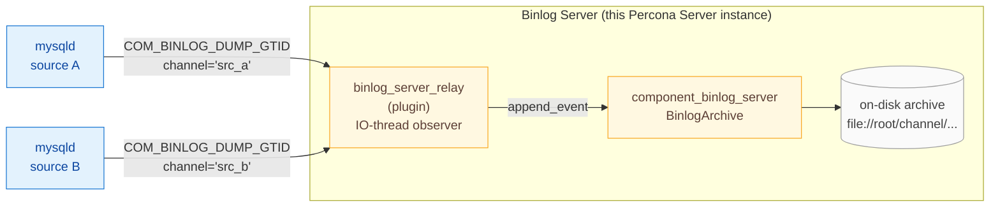

# Binlog Server &mdash; Documentation

A Percona Server 9.6 add-on that turns a MySQL instance into a **binlog
collector**: it connects to one or many upstream MySQL sources as a
standard asynchronous replica, intercepts the raw binary log stream via
the IO thread, and materialises it onto local storage as verbatim
replicas of the source's binlog files.

It is not a SQL applier. It never opens a transaction, never runs DDL,
never creates a single row. From the upstream's point of view it is an
ordinary asynchronous replica that only runs the IO thread.



## Documentation map

| Page | Audience | What you'll find |
| --- | --- | --- |
| [Overview](overview.md) | Everyone | The problem, the use cases, the moving parts, the glossary. Read this first. |
| [User guide](user_guide.md) | Operators | System variables, `CHANGE REPLICATION SOURCE` syntax, installation, day-2 operations. |
| [Architecture](architecture.md) | Architects, reviewers | Component / plugin / server split, data-flow diagrams, threading model, failure model. |
| [Low-level design](design.md) | Developers | Module layout, locking discipline, on-disk file format, deduplication watermark, crash recovery, observer lifecycle, error code catalogue. |

## Quickstart

```sql
-- 1) Load the moving parts (run on the binlog-server node).
INSTALL COMPONENT 'file://component_binlog_server';
INSTALL PLUGIN binlog_server_relay SONAME 'binlog_server_relay.so';

-- 2) Tell it where to put the archive.
SET GLOBAL binlog_server.default_storage_uri = 'file:///var/binlog-store/';

-- 3) Point a channel at an upstream and start collecting. GTID_MODE
--    must be ON and SOURCE_AUTO_POSITION must be 1 for BINLOG_SERVER.
CHANGE REPLICATION SOURCE TO
    SOURCE_HOST           = 'src-a.example.com',
    SOURCE_PORT           = 3306,
    SOURCE_USER           = 'repl',
    SOURCE_PASSWORD       = '...',
    SOURCE_AUTO_POSITION  = 1,
    BINLOG_SERVER         = 1
    FOR CHANNEL 'src_a';

START REPLICA IO_THREAD FOR CHANNEL 'src_a';

-- 4) Verify collection is active.
SELECT SERVICE_STATE
FROM performance_schema.replication_connection_status
WHERE CHANNEL_NAME = 'src_a';
```

## At a glance

| Aspect | What it means |
| --- | --- |
| **Single binary, two pieces** | `component_binlog_server` owns storage; `binlog_server_relay` is the IO-thread observer plugin that ships events into it. |
| **One channel per upstream** | Each channel has its own on-disk subdirectory, its own mutex, its own watermark. No global serialisation between channels. |
| **No SQL applier** | `BINLOG_SERVER=1` strips the SQL thread off the channel. The binlog server is a write-back buffer, never an applier. |
| **GTID auto-position only** | `BINLOG_SERVER` requires `SOURCE_AUTO_POSITION=1`. |
| **Crash-safe** | On startup, the archive walks the last file to find the last fully-written event, truncates any partial tail, and restores the watermark. |
| **Durable at transaction boundaries** | Every `Xid` / `XA_prepare` event triggers an `fsync(2)`, ensuring committed transactions survive a power loss. |

## Current status (Phase 1)

Phase 1 implements the **collection path** only:

- Receive binlogs from upstream sources via the IO thread
- Store them as local files mirroring the source's binlog naming
- Maintain a `binlog.index` per channel
- Crash recovery with partial-event truncation
- Transaction-boundary fsync for durability

**Not yet implemented** (planned for later phases):
- Serving collected binlogs to downstream replicas
- S3-compatible object storage backend
- Performance Schema observability tables
- Binlog purging
- Local rotation / rewriting

## License

GPLv2, matching the rest of Percona Server.
