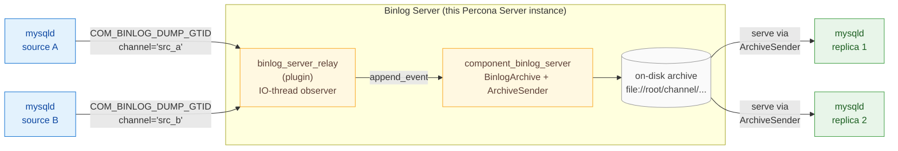

# Binlog Server &mdash; Documentation

A Percona Server 9.6 add-on that turns a MySQL instance into a **binlog
server**: it connects to one or many upstream MySQL sources as a
standard asynchronous replica, intercepts the raw binary log stream via
the IO thread, materialises it onto local storage, and **serves** it to
downstream replicas via standard MySQL replication protocol.

It is not a SQL applier. It never opens a transaction, never runs DDL,
never creates a single row. From the upstream's point of view it is an
ordinary asynchronous replica that only runs the IO thread. From a
downstream replica's point of view it is a standard MySQL source.

## Implemented features

| Feature | Description |
| --- | --- |
| **Multi-source archive** | Collect binlogs from multiple independent upstream clusters on one binlog server, each on its own replication channel. |
| **Archive-only storage** | Store upstream binlogs for relay and recovery; the binlog server does not apply transactions to its own data. |
| **Per-channel storage** | Give each upstream channel its own on-disk storage location. |
| **Standard downstream replication** | Downstream replicas connect with normal `CHANGE REPLICATION SOURCE` and `START REPLICA`; no special client or protocol is required. |
| **GTID-based positioning** | Use GTID auto-positioning for both collecting from upstream sources and serving downstream replicas. |
| **User-channel map** | Route each downstream replication user to a specific channel archive, via a configuration variable or a persisted table. |
| **Routing reload** | Refresh table-backed user-to-channel mappings without restarting the server. |
| **Live tailing** | New events from upstream appear in the archive and are relayed to downstream replicas in near real time. |
| **Multiple downstream replicas** | Several replicas can pull from the same channel archive at the same time. |
| **Performance Schema monitoring** | Inspect channel status, storage usage, and per-file archive details in Performance Schema. |
| **Per-file metadata** | Each archived binlog file records timestamp and GTID coverage for search, purge, and recovery planning. |
| **Crash-safe archive** | Survive server restarts; incomplete writes at the end of a file are recovered automatically. |
| **Durable commits** | Persist committed upstream work durably at transaction boundaries. |
| **Purge by file name** | Remove archived files up to a chosen binlog file. |
| **Purge by GTID set** | Remove archived files that are no longer needed based on GTID coverage. |
| **Purge by timestamp** | Remove archived files older than a given time. |
| **Search by timestamp** | Find which archived files cover a time range for point-in-time recovery. |
| **Search by GTID set** | Find the smallest set of files needed to cover a GTID range. |
| **Archive index rebuild** | Rebuild archive metadata after manual file changes or missing sidecar data. |
| **Encryption at rest** | Optionally encrypt archived binlog files using the keyring; decryption is transparent to downstream replicas. |
| **Encryption key rotation** | Rotate encryption keys online without stopping collection or serving. |
| **REST API** | Monitor and manage the binlog server over HTTP/HTTPS for automation and integration. |
| **Web dashboard** | Use a browser UI for topology, archive browsing, search, operations, and configuration. |



## Documentation map

| Page | Audience | What you'll find |
| --- | --- | --- |
| [Overview](overview.md) | Everyone | The problem, the use cases, the moving parts, the glossary. Read this first. |
| [User guide](user_guide.md) | Operators | System variables, `CHANGE REPLICATION SOURCE` syntax, installation, day-2 operations. |
| [Architecture](architecture.md) | Architects, reviewers | Component / plugin / server split, data-flow diagrams, threading model, failure model. |
| [Low-level design](design.md) | Developers | Module layout, locking discipline, on-disk file format, deduplication watermark, crash recovery, observer lifecycle, error code catalogue. |

## Quickstart

```sql
-- 1) Load the moving parts (run on the binlog-server node).
INSTALL COMPONENT 'file://component_binlog_server';
INSTALL PLUGIN binlog_server_relay SONAME 'binlog_server_relay.so';

-- 2) Tell it where to put the archive.
SET GLOBAL binlog_server.default_storage_uri = 'file:///var/binlog-store/';

-- 3) Point a channel at an upstream and start collecting. GTID_MODE
--    must be ON and SOURCE_AUTO_POSITION must be 1 for BINLOG_SERVER.
CHANGE REPLICATION SOURCE TO
    SOURCE_HOST           = 'src-a.example.com',
    SOURCE_PORT           = 3306,
    SOURCE_USER           = 'repl',
    SOURCE_PASSWORD       = '...',
    SOURCE_AUTO_POSITION  = 1,
    BINLOG_SERVER         = 1
    FOR CHANNEL 'src_a';

START REPLICA IO_THREAD FOR CHANNEL 'src_a';

-- 4) Enable serving: downstream replicas connecting to this node
--    will be served from the 'src_a' archive.
SET GLOBAL binlog_server.default_serve_channel = 'src_a';

-- 5) On a downstream replica, point at the binlog-server node:
--    CHANGE REPLICATION SOURCE TO
--      SOURCE_HOST = 'binlog-server.example.com',
--      SOURCE_PORT = 3306,
--      SOURCE_USER = 'repl',
--      SOURCE_AUTO_POSITION = 1;
--    START REPLICA;
```

## At a glance

| Aspect | What it means |
| --- | --- |
| **Single binary, two pieces** | `component_binlog_server` owns storage and serving; `binlog_server_relay` is the IO-thread observer plugin that ships events into it. |
| **One channel per upstream** | Each channel has its own on-disk subdirectory, its own mutex, its own watermark. No global serialisation between channels. |
| **Serve to multiple downstreams** | The `ArchiveSender` intercepts `COM_BINLOG_DUMP_GTID` and streams archived events to any number of concurrent downstream replicas. |
| **No SQL applier** | `BINLOG_SERVER=1` strips the SQL thread off the channel. The binlog server is a write-back buffer, never an applier. |
| **GTID auto-position only** | `BINLOG_SERVER` requires `SOURCE_AUTO_POSITION=1`. |
| **Crash-safe** | On startup, the archive walks the last file to find the last fully-written event, truncates any partial tail, and restores the watermark. |
| **Durable at transaction boundaries** | Every `Xid` / `XA_prepare` event triggers an `fsync(2)`, ensuring committed transactions survive a power loss. |
| **At-rest encryption** | Optional AES-256-CTR encryption with keyring-managed master keys. Online key rotation without stopping collection. Transparent decryption when serving to replicas. |

## Current status (Phase 1–8)

**Phase 1** — collection path:

- Receive binlogs from upstream sources via the IO thread
- Store them as local files mirroring the source's binlog naming
- Maintain a `binlog.index` per channel
- Crash recovery with partial-event truncation
- Transaction-boundary fsync for durability

**Phase 2** — serve path:

- Downstream replicas connect with standard `CHANGE REPLICATION SOURCE` + `START REPLICA`
- `COM_BINLOG_DUMP_GTID` intercepted via atomic dispatch slot in `mysql_binlog_send()`
- GTID AUTO_POSITION fully supported (reverse-walk archive index to find starting file)
- GTID filtering: transactions already in the replica's executed set are skipped
- Tail-follow on the actively-written file with heartbeat every 5 seconds
- Multiple concurrent downstream replicas supported
- `default_serve_channel` sysvar routes dump connections to a named channel archive

**Phase 3** — per-user channel routing:

- `binlog_server.user_channel_map` sysvar for user-to-channel routing
- Two configuration shapes: inline CSV (`user1=ch1,user2=ch2`) and `table://<db>.<tbl>`
- `binlog_server_reload_user_channel_map()` UDF for on-demand table reload
- `default_serve_channel` as fallback for unmapped users
- Multiple upstream sources collected simultaneously with independent per-channel archives
- Channel path sanitization (whitelist `[A-Za-z0-9_.-]`)
- Per-channel `BINLOG_SERVER_STORAGE_URI` override

**Phase 4** — observability + per-file metadata:

- Three Performance Schema tables: `replication_binlog_server_status`, `replication_binlog_server_storage`, `replication_binlog_server_archive`
- Per-channel operational counters: events appended, bytes, duplicates dropped, write errors, timestamps, last error
- Per-channel storage summary: file count, total disk usage, active/idle status, GTID set covered
- Per-file metadata: size, event count, min/max timestamps, Previous_gtid and accumulated GTID sets
- `.meta` sidecar files for fast metadata recovery (no full-archive rescan on startup)
- `binlog_server_rebuild_archive_index()` UDF for backfilling missing metadata

**Phase 5** — binlog purge + architecture for rotation & S3:

- Purge operations: by file, GTID set, or timestamp (UDFs)
- Atomic index-first commit order (tmp + fsync + rename before deletion)
- Pin-based safety: files actively served to a downstream replica cannot be purged
- S3 storage backend stub (`s3://` URIs recognized, all I/O returns "not implemented")
- Rewrite/rotation architecture stub (`rewrite_file_size`, `rewrite_base_name` sysvars)
- GTID renumberer stub for logical-clock adjustment in rewrite mode

**Phase 6** — at-rest encryption:

- Per-channel at-rest encryption using AES-256-CTR
- Two-tier key hierarchy: keyring-managed master key wraps a per-file random password
- Transparent decryption when serving to downstream replicas
- `binlog_server.encryption` sysvar (ON/OFF) to enable/disable
- `binlog_server_rotate_encryption_key(channel)` UDF for online master key rotation
- Keyring integration via `component_keyring_file` (any keyring component works)
- `StorageWriteStream` / `StorageReadStream` abstractions for storage-agnostic I/O
- Encryption operates above the storage backend: same logic works for file:// and future S3

**Phase 7** — REST API + web dashboard:

- Separate `component_binlog_server_rest_api` component (independent from core)
- Embedded HTTP/HTTPS server (cpp-httplib) on configurable port (default 8440)
- HTTP Basic Auth with configurable username/password
- HTTPS support via configurable PEM cert/key paths
- Full REST API: status, storage, archive, topology, purge, key rotation, variable management
- Self-contained single-page web dashboard with live topology diagram (loaded from file at runtime — edit and refresh)
- Dashboard shows sources, channels, storage, downstream replicas as animated SVG
- All operations accessible via both SQL and REST endpoints

**Phase 8** — search by timestamp / GTID set:

- `binlog_server_search_by_timestamp(channel, iso_timestamp)` UDF — finds binlog files spanning a timestamp (for PITR)
- `binlog_server_search_by_gtid_set(channel, gtid_set)` UDF — finds minimal file set covering a GTID range
- REST endpoints: `POST /api/v1/search/by-timestamp`, `POST /api/v1/search/by-gtid-set`, `GET /api/v1/range/:channel`
- Dashboard "Search" tab with available range display and interactive search forms
- ISO-8601 timestamp parsing (`YYYY-MM-DDTHH:MM:SS` or `YYYY-MM-DD HH:MM:SS`, UTC)

**Not yet implemented** (planned for later phases):
- S3-compatible object storage backend (stubs in place)
- Local rotation / rewriting (stubs in place)

## Project Statistics

| Metric | Count |
|--------|-------|
| New source files (C++, headers, CMake, HTML) | 55 |
| New MTR test files (.test, .result, .inc, .cnf) | 38 |
| Modified Percona Server core files (sql/, scripts/, share/) | 15 |
| Total lines added (excluding docs) | 26,459 |
| Lines deleted in existing PS code | 6 |

### Breakdown by area

| Area | Lines | Description |
|------|-------|-------------|
| `components/binlog_server/` | 7,835 | Core component: archive, sender, encryption, PFS, GTID, UDFs |
| `components/binlog_server_rest_api/` (C++) | 1,319 | REST API handlers, SQL executor, JSON helpers |
| `components/binlog_server_rest_api/` (dashboard) | 649 | Single-page web dashboard (HTML/CSS/JS) |
| `components/binlog_server_rest_api/` (cpp-httplib) | 10,356 | Vendored HTTP library (third-party) |
| `plugin/binlog_server_relay/` | 192 | Relay plugin (IO-thread observer) |
| `sql/`, `scripts/`, `share/` | 775 | Server core: parser, replication, services |
| `mysql-test/suite/binlog_server/` | 5,108 | Integration tests (19 test cases) |

### Features delivered

| Feature | Details |
|---------|---------|
| UDFs | 8 (reload, rebuild, purge ×3, search ×2, key rotation) |
| Performance Schema tables | 3 (status, storage, archive) |
| REST API endpoints | 20 |
| MTR test cases | 19 |
| Commits | 10 |
| Vendored dependencies | 1 (cpp-httplib) |

### Modified Percona Server files

These 15 files in the existing PS codebase required changes to support
the binlog server plugin/component hooks:

- `sql/sql_yacc.yy` — `BINLOG_SERVER` / `BINLOG_SERVER_STORAGE_URI` syntax
- `sql/lex.h` — new keywords
- `sql/sql_lex.cc`, `sql/sql_lex.h` — LEX fields for new options
- `sql/rpl_mi.cc`, `sql/rpl_mi.h` — master-info storage for BS fields
- `sql/rpl_replica.cc` — IO-thread logic to call BS component
- `sql/rpl_source.cc` — dump-handler registration for downstream serving
- `sql/CMakeLists.txt` — new source files
- `sql/server_component/CMakeLists.txt`, `sql/server_component/server_component.cc` — service implementations
- `scripts/mysql_system_tables.sql`, `scripts/mysql_system_tables_fix.sql` — system table schema for BS
- `share/messages_to_error_log.txt` — new error messages
- `mysql-test/include/plugin.defs` — MTR plugin registration

## License

GPLv2, matching the rest of Percona Server.
