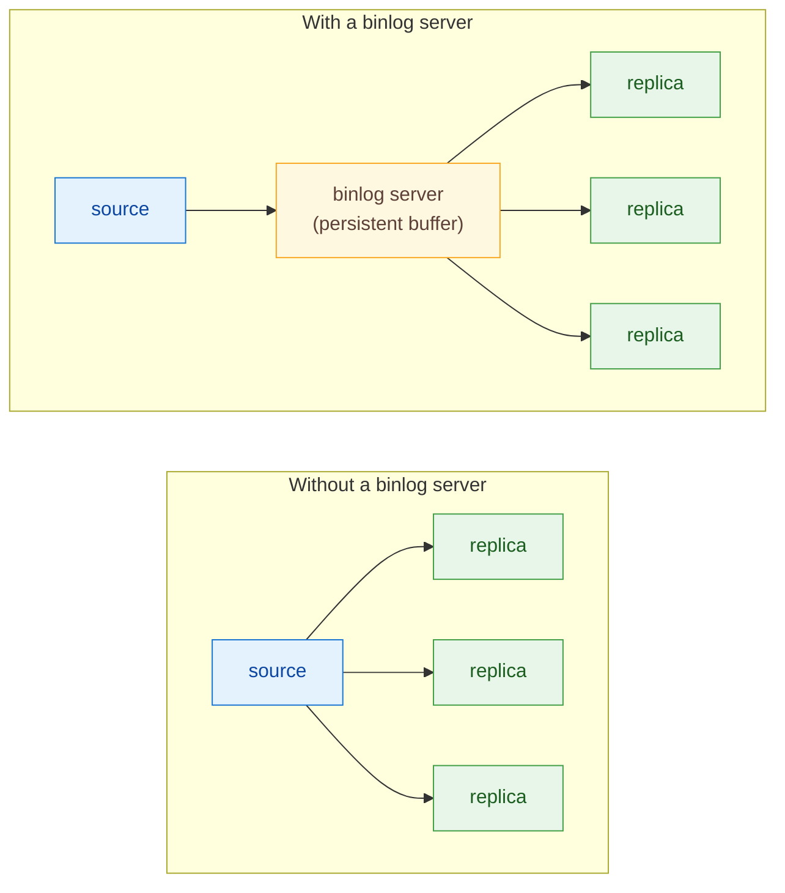
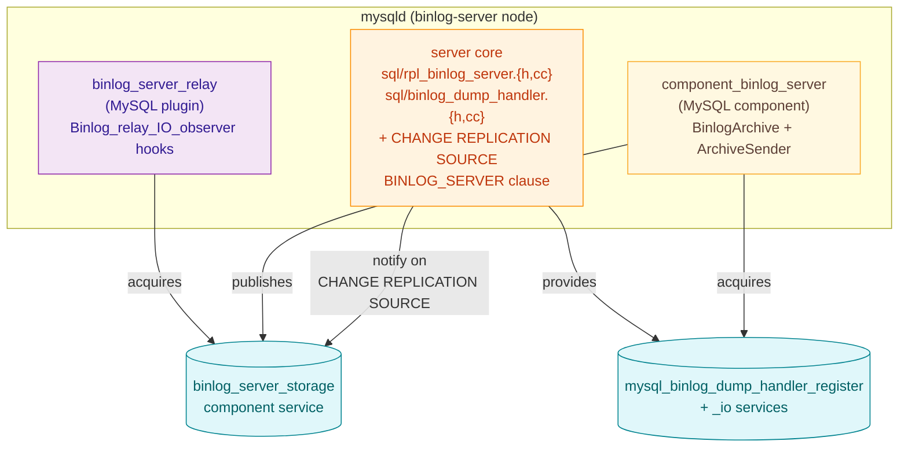

# Overview

[&larr; Back to index](index.md) &middot; **Overview** &middot;
[User guide](user_guide.md) &middot;
[Architecture](architecture.md) &middot;
[Low-level design](design.md)

## What it is

A **binlog server** is a Percona Server 9.6 instance that has been
configured to do two things:

1. **Collect** the raw binary log of one or more upstream MySQL sources
   into local on-disk files.
2. **Serve** those collected binlogs to downstream replicas via the
   standard MySQL replication protocol (`COM_BINLOG_DUMP_GTID`).

Crucially, it does **not** apply anything. Connecting an IO thread to
an upstream and disabling the SQL thread is not a new idea (the
`BINLOG_SERVER` clause on `CHANGE REPLICATION SOURCE` is exactly that
switch); the rest of the work &mdash; persistent on-disk archives with a
deduplication watermark, crash recovery, idempotent index management,
transaction-boundary durability, and a full-featured serving engine
with GTID AUTO_POSITION &mdash; is what makes the result an actual
*server* rather than just a stalled replica.

## Why it exists

The classic MySQL replication topology pushes a lot of moving parts to
the edge:

- Every downstream replica opens a long-lived dump thread against the
  source. Two hundred replicas means two hundred concurrent dump
  threads competing for the source's binlog page cache.
- The source's binlog retention dictates downstream recovery. Lose your
  retention window and a backed-up replica has to be rebuilt.
- Cross-WAN replicas pay the WAN cost on every fanout.

A binlog server inverts that: the source ships one stream to one node
that **persists** it, and that node serves it to all downstream
replicas on demand.

## Use cases

### 1. Replica fan-out at scale

One source, many replicas. Without a binlog server the source pays for
every reader. With a binlog server the source pays for one TCP
connection; downstream replicas all read from the binlog server's
local archive.

### 2. Cross-region buffer

Keep an in-region binlog server warm with a single WAN-bound dump
thread; replicas in the remote region talk to the local binlog server
over the LAN instead of crossing the WAN individually.

### 3. Fan-in (multi-source archiver)

A single binlog server collects multiple unrelated sources into
side-by-side archives, each on its own channel.

### 4. Offline replica catch-up buffer

A replica that has been offline for hours can resume from the binlog
server's on-disk archive even after the upstream has rotated out the
binlogs it needed. The binlog server serves from whatever it has
persisted, using GTID AUTO_POSITION to skip already-applied
transactions.

## What's in the box

Two artifacts ship with this feature, both built from the same source
tree:

- **Server core** (in `sql/`). The `BINLOG_SERVER` and
  `BINLOG_SERVER_STORAGE_URI` clauses for `CHANGE REPLICATION SOURCE`,
  the persistence in `mysql.slave_master_info`, the SQL-thread
  suppression mask, the notify layer (`sql/rpl_binlog_server.{h,cc}`)
  that calls the storage service when an operator runs
  `CHANGE REPLICATION SOURCE`, and the **binlog dump handler dispatch
  slot** (`sql/binlog_dump_handler.{h,cc}`) that allows the component
  to intercept `COM_BINLOG_DUMP_GTID` requests before the standard
  `Binlog_sender`.
- **`binlog_server_relay` plugin** (in
  `plugin/binlog_server_relay/`). Registers itself as a
  `Binlog_relay_IO_observer`. Its `after_queue_event` callback fires
  for every event the IO thread queues, and that's what feeds raw
  bytes into the component. Also handles `thread_start` /
  `thread_stop` / `after_reset_slave` so a stop/start cycle does the
  right thing.
- **`component_binlog_server` component** (in
  `components/binlog_server/`). The storage and serving engine. Owns
  the on-disk archive, the per-channel state, the
  `binlog_server_storage` service implementation, and the
  **`ArchiveSender`** that serves collected binlogs to downstream
  replicas via the dump handler dispatch slot.

The split is intentional. The relay plugin handles the IO-thread
event-rate hot path (registered observer callbacks; cannot fail to
load lightly). The component owns persistent state, configuration,
and the serving engine.
The server-core hooks are the smallest interfaces that let both live
as out-of-tree-ish loadables.

## Glossary

| Term | Meaning |
| --- | --- |
| **Channel** | A named replication relationship on the binlog server. Each channel collects one upstream source into its own subdirectory under the storage root. Created with `CHANGE REPLICATION SOURCE ... FOR CHANNEL '<name>'`. |
| **Archive** | The on-disk materialisation of a channel's collected binlog files. Lives at `<storage-uri>/<channel-name>/<source-binlog-name>` and is byte-identical to the upstream's binlog. |
| **`binlog.index`** | A line-per-filename index file the archive maintains under each channel directory, matching what MySQL itself maintains for its own binary log. |
| **FDE** | The Format Description Event (event type 15). The first event in every binlog file; declares format version, server version, checksum algorithm. The binlog server re-uses the FDE the source sends so the on-disk file is a valid standalone binlog. |
| **Watermark / `last_source_log_pos`** | The largest `log_pos` value (byte offset within the current upstream binlog file) that the binlog server has durably appended to its archive. Events that arrive with `log_pos <= watermark` on the same file are treated as duplicates and dropped. |
| **`default_storage_uri`** | The fallback URI used when a channel is created with `BINLOG_SERVER=1` but no `BINLOG_SERVER_STORAGE_URI` of its own. Typically `file:///var/binlog-store/`. |
| **`default_serve_channel`** | Sysvar (`binlog_server.default_serve_channel`) that names the channel whose archive is served to downstream replicas when they issue `COM_BINLOG_DUMP_GTID`. |
| **`ChannelState`** | The per-channel I/O bookkeeping struct inside `BinlogArchive` &mdash; mutex, current file, watermark, checksum flag, indexed-file set, event counters, fsync fd. Held in `shared_ptr` inside a registry map; per-channel mutex isolates appends on different channels. |
| **`BinlogArchive`** | The top-level archive object inside the component. Owns the per-channel registry and the binlog protocol logic (event parsing, FDE caching, source-rotate handling, deduplication, crash recovery). |
| **`ArchiveSender`** | Singleton that manages dump sessions. When a dump request arrives, it resolves the target channel, opens an `ArchiveDumpSession`, and streams events until the downstream disconnects. |
| **`ArchiveDumpSession`** | The per-connection serving session. Resolves the GTID start position, walks archive files sending events, filters by GTID, and tail-follows the active file with heartbeats. |
| **Dump handler dispatch slot** | An atomic function-pointer slot in `sql/binlog_dump_handler.{h,cc}` that the component installs at load time. If set, `mysql_binlog_send()` delegates to the component instead of the built-in `Binlog_sender`. |

## What it explicitly is NOT

- **Not a replication group member.** No group-replication semantics,
  no certification, no conflict detection. The binlog server is a
  pure pipe.
- **Not a backup product.** The archive is a verbatim copy of the
  source's binlog files; no backup verification, retention policy, or
  restore tooling is bundled.
- **Not a transform engine.** Events are forwarded byte-for-byte,
  modulo the deduplication watermark and the FDE handling that makes
  each archive file a valid standalone binlog.
- **Not a per-user router yet.** Phase 2 serves a single configured
  channel to all downstream replicas. Per-user routing (different
  channels to different replicas based on the connecting user) is
  planned for Phase 3.

## Continue reading

- Operating it day to day: [User guide](user_guide.md).
- How the pieces fit together: [Architecture](architecture.md).
- Implementation details, including the locking model and the on-disk
  format: [Low-level design](design.md).
