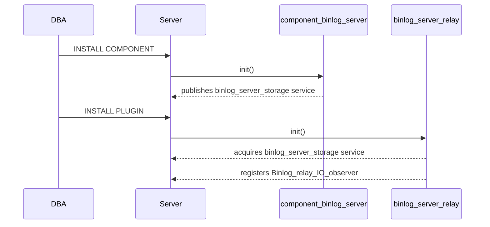
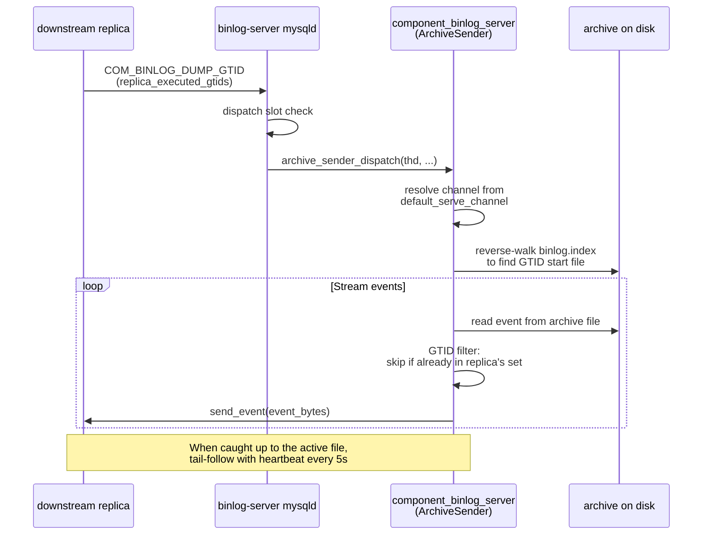
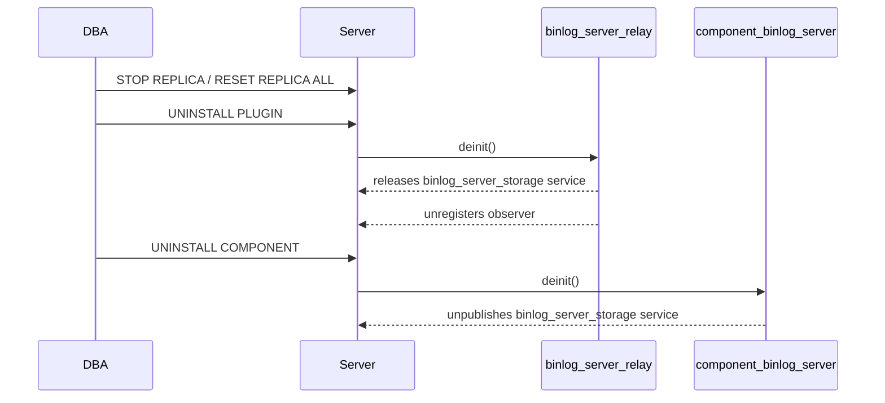

# User guide

[&larr; Back to index](index.md) &middot;
[Overview](overview.md) &middot;
**User guide** &middot;
[Architecture](architecture.md) &middot;
[Low-level design](design.md)

## Contents

- [Prerequisites](#prerequisites)
- [Installation](#installation)
- [CHANGE REPLICATION SOURCE additions](#change-replication-source-additions)
- [Configuring a channel](#configuring-a-channel)
- [Multi-channel collection](#multi-channel-collection)
- [Serving to downstream replicas](#serving-to-downstream-replicas)
- [System variables](#system-variables)
- [Stopping and restarting](#stopping-and-restarting)
- [Resume after crash](#resume-after-crash)
- [Day-2 operations](#day-2-operations)
- [Uninstalling](#uninstalling)
- [Troubleshooting](#troubleshooting)

## Prerequisites

| Requirement | Why |
| --- | --- |
| Percona Server 9.6+ | Required for BINLOG_SERVER syntax support |
| `GTID_MODE = ON` on both source and binlog-server node | GTID-based positioning is mandatory |
| `SOURCE_AUTO_POSITION = 1` | The only positioning mode supported by `BINLOG_SERVER=1` |
| Replication user on the upstream | Standard `REPLICATION SLAVE` privilege |
| Writeable directory for archive storage | The component must be able to create subdirectories and files |

## Installation

Load the component first (it provides the storage service), then the
plugin (it acquires the service):

```sql
-- Load the component.
INSTALL COMPONENT 'file://component_binlog_server';

-- Load the plugin.
INSTALL PLUGIN binlog_server_relay SONAME 'binlog_server_relay.so';
```



**Order matters.** Installing the plugin before the component will
succeed (the plugin gracefully handles a missing service), but events
will not be stored until the component is loaded.

## CHANGE REPLICATION SOURCE additions

Two new clauses are available in `CHANGE REPLICATION SOURCE TO`:

```sql
CHANGE REPLICATION SOURCE TO
    ...
    BINLOG_SERVER         = {0|1},
    BINLOG_SERVER_STORAGE_URI = '<uri>'
    FOR CHANNEL '<channel_name>';
```

| Clause | Type | Description |
| --- | --- | --- |
| `BINLOG_SERVER` | Boolean (0/1) | Enables binlog-server mode for the channel. When 1, the SQL thread is suppressed and events are routed to the storage component instead of the relay log. |
| `BINLOG_SERVER_STORAGE_URI` | String | The storage URI for this channel. Currently only `file://` is supported. When empty or omitted, the component's `default_storage_uri` is used. |

### Validation rules

| Rule | Error |
| --- | --- |
| `BINLOG_SERVER=1` requires `SOURCE_AUTO_POSITION=1` | `ER_WRONG_VALUE_FOR_VAR` |
| Cannot disable `SOURCE_AUTO_POSITION` on an active BINLOG_SERVER channel | `ER_WRONG_VALUE_FOR_VAR` |
| `BINLOG_SERVER=1` and `GTID_ONLY=1` are mutually exclusive | `ER_WRONG_VALUE_FOR_VAR` |
| URI must start with `file://` | `ER_WRONG_VALUE_FOR_VAR` |
| URI length must be under 1024 bytes | `ER_WRONG_VALUE_FOR_VAR` |
| `START REPLICA SQL_THREAD` is rejected on BINLOG_SERVER channels | `ER_SLAVE_CHANNEL_OPERATION_NOT_ALLOWED` |

## Configuring a channel

A minimal example connecting to an upstream:

```sql
CHANGE REPLICATION SOURCE TO
    SOURCE_HOST          = '10.0.0.1',
    SOURCE_PORT          = 3306,
    SOURCE_USER          = 'repl_user',
    SOURCE_PASSWORD      = 'secret',
    SOURCE_AUTO_POSITION = 1,
    BINLOG_SERVER        = 1,
    BINLOG_SERVER_STORAGE_URI = 'file:///data/binlog-archive/'
    FOR CHANNEL 'prod_primary';

START REPLICA IO_THREAD FOR CHANNEL 'prod_primary';
```

The component creates the directory structure:

```
/data/binlog-archive/
└── prod_primary/
    ├── binlog.index
    ├── binlog.000001
    ├── binlog.000002
    └── ...
```

File names mirror the source's binlog file names exactly.

## Multi-channel collection

Multiple channels can collect from different sources simultaneously:

```sql
CHANGE REPLICATION SOURCE TO
    SOURCE_HOST = 'src-a.example.com', SOURCE_PORT = 3306,
    SOURCE_USER = 'repl', SOURCE_PASSWORD = '...',
    SOURCE_AUTO_POSITION = 1, BINLOG_SERVER = 1,
    BINLOG_SERVER_STORAGE_URI = 'file:///data/archive/'
    FOR CHANNEL 'src_a';

CHANGE REPLICATION SOURCE TO
    SOURCE_HOST = 'src-b.example.com', SOURCE_PORT = 3306,
    SOURCE_USER = 'repl', SOURCE_PASSWORD = '...',
    SOURCE_AUTO_POSITION = 1, BINLOG_SERVER = 1,
    BINLOG_SERVER_STORAGE_URI = 'file:///data/archive/'
    FOR CHANNEL 'src_b';

START REPLICA IO_THREAD FOR CHANNEL 'src_a';
START REPLICA IO_THREAD FOR CHANNEL 'src_b';
```

Each channel gets its own subdirectory under the URI:

```
/data/archive/
├── src_a/
│   ├── binlog.index
│   └── binlog.000001
└── src_b/
    ├── binlog.index
    └── binlog.000001
```

Channels are fully independent: they have separate mutexes, separate
watermarks, and can be started/stopped independently.

## Serving to downstream replicas

Once the binlog server is collecting from an upstream source, you can
configure downstream replicas to replicate from the binlog server node
instead of directly from the source.

### Setting the serve channel

Tell the component which channel's archive to serve:

```sql
-- On the binlog-server node:
SET GLOBAL binlog_server.default_serve_channel = 'src_a';
```

All downstream replicas connecting to this node will be served events
from the `src_a` channel archive.

### Configuring a downstream replica

On each downstream replica, point at the binlog-server node using
standard replication commands:

```sql
-- On the downstream replica:
CHANGE REPLICATION SOURCE TO
    SOURCE_HOST          = 'binlog-server.example.com',
    SOURCE_PORT          = 3306,
    SOURCE_USER          = 'repl_user',
    SOURCE_PASSWORD      = 'secret',
    SOURCE_AUTO_POSITION = 1;

START REPLICA;
```

The downstream replica sees the binlog server as an ordinary MySQL
source. `SOURCE_AUTO_POSITION=1` is required so that GTID-based
positioning works correctly.

### How it works



### Multiple downstream replicas

The binlog server supports multiple concurrent downstream replicas.
Each dump connection gets its own `ArchiveDumpSession` with
independent file handles and GTID state. There is no shared lock
between dump sessions, so they do not block each other.

```sql
-- Replica A:
CHANGE REPLICATION SOURCE TO
    SOURCE_HOST = 'binlog-server.example.com', SOURCE_PORT = 3306,
    SOURCE_USER = 'repl', SOURCE_AUTO_POSITION = 1;
START REPLICA;

-- Replica B (same binlog server, independent session):
CHANGE REPLICATION SOURCE TO
    SOURCE_HOST = 'binlog-server.example.com', SOURCE_PORT = 3306,
    SOURCE_USER = 'repl', SOURCE_AUTO_POSITION = 1;
START REPLICA;
```

### GTID AUTO_POSITION behaviour

When a downstream replica connects with `SOURCE_AUTO_POSITION=1`:

1. The replica sends its `Executed_Gtid_Set` (all GTIDs it has already
   applied).
2. The `ArchiveSender` reverse-walks the archive's `binlog.index`,
   reading `Previous_gtids_log_event` from each file to find the
   earliest file that contains transactions not in the replica's set.
3. Events belonging to transactions already in the replica's set are
   filtered (not sent).
4. Once all historical events are sent, the session tail-follows the
   active file, polling for new data and sending heartbeats.

## System variables

| Variable | Scope | Type | Default | Description |
| --- | --- | --- | --- | --- |
| `binlog_server.default_storage_uri` | GLOBAL | String | `''` | Default `file://` URI for new BINLOG_SERVER channels |
| `binlog_server.default_serve_channel` | GLOBAL | String | `''` | Channel name whose archive is served to downstream replicas |

## Stopping and restarting

```sql
-- Stop collection for a specific channel.
STOP REPLICA IO_THREAD FOR CHANNEL 'src_a';

-- Restart. Collection resumes from where it left off (GTID auto-pos).
START REPLICA IO_THREAD FOR CHANNEL 'src_a';
```

On restart, the IO thread reconnects to the source using
`SOURCE_AUTO_POSITION`. The watermark ensures no duplicate events are
written to the archive.

## Resume after crash

If the server crashes or is killed, the archive is automatically
recovered on the next `configure_channel` call (triggered by
`CHANGE REPLICATION SOURCE` or server restart with persisted channels):

1. The index file (`binlog.index`) is read to discover existing files.
2. The last file is opened and walked event-by-event to find the last
   fully-written event.
3. Any partial tail (incomplete event) is truncated.
4. The watermark (`last_source_log_pos`) is restored from the last
   complete event's `log_pos`.
5. The FDE flag and checksum flag are re-derived from the file header.

This guarantees that collection can resume seamlessly after any crash.

## Day-2 operations

### Checking channel status

```sql
-- Standard replication status.
SELECT * FROM performance_schema.replication_connection_status
WHERE CHANNEL_NAME = 'src_a';

-- Archive directory listing (from the shell).
ls -la /data/archive/src_a/
cat /data/archive/src_a/binlog.index
```

### Removing a channel

```sql
STOP REPLICA IO_THREAD FOR CHANNEL 'src_a';
RESET REPLICA ALL FOR CHANNEL 'src_a';
```

`RESET REPLICA ALL` removes the channel's configuration from
`mysql.slave_master_info`. The on-disk archive files are **not**
automatically deleted; remove them manually if no longer needed.

### Disabling binlog-server mode

```sql
STOP REPLICA IO_THREAD FOR CHANNEL 'src_a';
CHANGE REPLICATION SOURCE TO BINLOG_SERVER = 0 FOR CHANNEL 'src_a';
```

The channel reverts to a normal replication channel.

## Uninstalling

Remove in reverse order (plugin first, component second):

```sql
-- 1) Stop all binlog-server channels.
STOP REPLICA IO_THREAD FOR CHANNEL 'src_a';

-- 2) Remove channel configuration.
RESET REPLICA ALL FOR CHANNEL 'src_a';

-- 3) Unload in reverse order.
UNINSTALL PLUGIN binlog_server_relay;
UNINSTALL COMPONENT 'file://component_binlog_server';
```



## Troubleshooting

| Symptom | Probable cause | Resolution |
| --- | --- | --- |
| `INSTALL PLUGIN` succeeds but no events stored | Component not loaded, or loaded after plugin | Load component first: `INSTALL COMPONENT 'file://component_binlog_server'` |
| `ER_WRONG_VALUE_FOR_VAR` on `CHANGE REPLICATION SOURCE` | Missing `SOURCE_AUTO_POSITION=1`, or bad URI format | Ensure auto-position is enabled; URI must start with `file://` |
| Archive directory empty after `START REPLICA` | Channel configured with `BINLOG_SERVER=0` or URI path not writable | Check `BINLOG_SERVER=1` and directory permissions |
| Events appear duplicated | Should not happen &mdash; watermark deduplication is automatic | Check error log for crash-recovery messages; file a bug if duplicates persist |
| `cannot configure channel` in error log | Component loaded but URI invalid or empty | Set a valid `BINLOG_SERVER_STORAGE_URI` or ensure `default_storage_uri` is configured |
| `START REPLICA SQL_THREAD` rejected | Expected: SQL thread is suppressed on BINLOG_SERVER channels | Use `START REPLICA IO_THREAD` only |
| Downstream replica connects but gets no events | `default_serve_channel` not set or set to wrong channel | `SET GLOBAL binlog_server.default_serve_channel = '<channel>'` |
| Downstream replica falls behind | Archive on disk may not have caught up yet | Verify the upstream IO thread is running and the channel is actively collecting |
| Downstream shows `Got fatal error 1236` | Archive files may have been manually deleted or purged | Rebuild the replica or ensure the archive contains the required GTID range |
