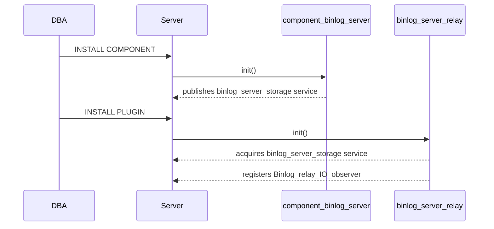
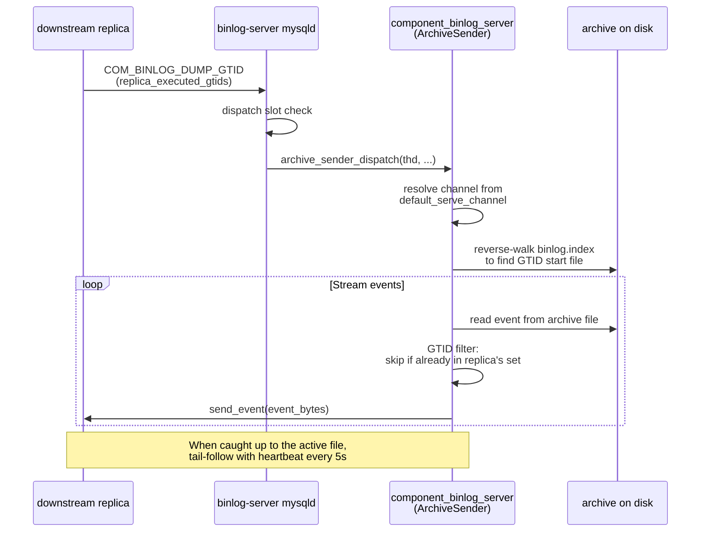
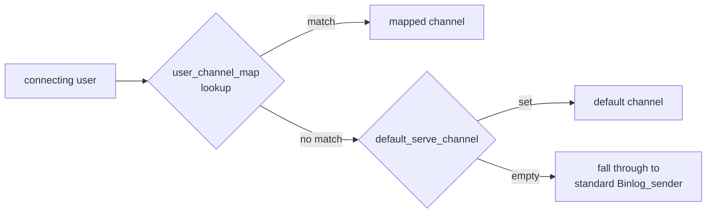
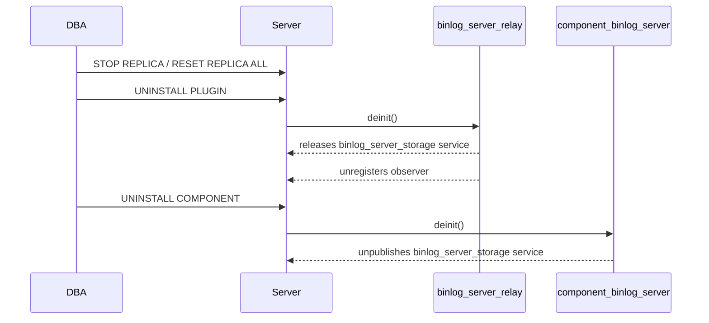

# User guide

[&larr; Back to index](index.md) &middot;
[Overview](overview.md) &middot;
**User guide** &middot;
[Architecture](architecture.md) &middot;
[Low-level design](design.md)

## Contents

- [Prerequisites](#prerequisites)
- [Installation](#installation)
- [CHANGE REPLICATION SOURCE additions](#change-replication-source-additions)
- [Configuring a channel](#configuring-a-channel)
- [Multi-channel collection](#multi-channel-collection)
- [Serving to downstream replicas](#serving-to-downstream-replicas)
- [Per-user channel routing](#per-user-channel-routing)
- [System variables](#system-variables)
- [UDFs](#udfs)
- [Stopping and restarting](#stopping-and-restarting)
- [Resume after crash](#resume-after-crash)
- [Day-2 operations](#day-2-operations)
- [Uninstalling](#uninstalling)
- [Troubleshooting](#troubleshooting)

## Prerequisites

| Requirement | Why |
| --- | --- |
| Percona Server 9.6+ | Required for BINLOG_SERVER syntax support |
| `GTID_MODE = ON` on both source and binlog-server node | GTID-based positioning is mandatory |
| `SOURCE_AUTO_POSITION = 1` | The only positioning mode supported by `BINLOG_SERVER=1` |
| Replication user on the upstream | Standard `REPLICATION SLAVE` privilege |
| Writeable directory for archive storage | The component must be able to create subdirectories and files |

## Installation

Load the component first (it provides the storage service), then the
plugin (it acquires the service):

```sql
-- Load the component.
INSTALL COMPONENT 'file://component_binlog_server';

-- Load the plugin.
INSTALL PLUGIN binlog_server_relay SONAME 'binlog_server_relay.so';
```



**Order matters.** Installing the plugin before the component will
succeed (the plugin gracefully handles a missing service), but events
will not be stored until the component is loaded.

## CHANGE REPLICATION SOURCE additions

Two new clauses are available in `CHANGE REPLICATION SOURCE TO`:

```sql
CHANGE REPLICATION SOURCE TO
    ...
    BINLOG_SERVER         = {0|1},
    BINLOG_SERVER_STORAGE_URI = '<uri>'
    FOR CHANNEL '<channel_name>';
```

| Clause | Type | Description |
| --- | --- | --- |
| `BINLOG_SERVER` | Boolean (0/1) | Enables binlog-server mode for the channel. When 1, the SQL thread is suppressed and events are routed to the storage component instead of the relay log. |
| `BINLOG_SERVER_STORAGE_URI` | String | The storage URI for this channel. Currently only `file://` is supported. When empty or omitted, the component's `default_storage_uri` is used. |

### Validation rules

| Rule | Error |
| --- | --- |
| `BINLOG_SERVER=1` requires `SOURCE_AUTO_POSITION=1` | `ER_WRONG_VALUE_FOR_VAR` |
| Cannot disable `SOURCE_AUTO_POSITION` on an active BINLOG_SERVER channel | `ER_WRONG_VALUE_FOR_VAR` |
| `BINLOG_SERVER=1` and `GTID_ONLY=1` are mutually exclusive | `ER_WRONG_VALUE_FOR_VAR` |
| URI must start with `file://` | `ER_WRONG_VALUE_FOR_VAR` |
| URI length must be under 1024 bytes | `ER_WRONG_VALUE_FOR_VAR` |
| `START REPLICA SQL_THREAD` is rejected on BINLOG_SERVER channels | `ER_SLAVE_CHANNEL_OPERATION_NOT_ALLOWED` |

## Configuring a channel

A minimal example connecting to an upstream:

```sql
CHANGE REPLICATION SOURCE TO
    SOURCE_HOST          = '10.0.0.1',
    SOURCE_PORT          = 3306,
    SOURCE_USER          = 'repl_user',
    SOURCE_PASSWORD      = 'secret',
    SOURCE_AUTO_POSITION = 1,
    BINLOG_SERVER        = 1,
    BINLOG_SERVER_STORAGE_URI = 'file:///data/binlog-archive/'
    FOR CHANNEL 'prod_primary';

START REPLICA IO_THREAD FOR CHANNEL 'prod_primary';
```

The component creates the directory structure:

```
/data/binlog-archive/
└── prod_primary/
    ├── binlog.index
    ├── binlog.000001
    ├── binlog.000002
    └── ...
```

File names mirror the source's binlog file names exactly.

### Storage root constraint

For production deployments, set `binlog_server.storage_root` to
constrain all storage URIs to a specific directory tree:

```sql
SET GLOBAL binlog_server.storage_root = '/data/binlog-archive';
```

Any `CHANGE REPLICATION SOURCE` with a `BINLOG_SERVER_STORAGE_URI`
that resolves outside this directory will be rejected. This prevents
accidental writes to system directories from misconfigured URIs.

## Multi-channel collection

Multiple channels can collect from different sources simultaneously:

```sql
CHANGE REPLICATION SOURCE TO
    SOURCE_HOST = 'src-a.example.com', SOURCE_PORT = 3306,
    SOURCE_USER = 'repl', SOURCE_PASSWORD = '...',
    SOURCE_AUTO_POSITION = 1, BINLOG_SERVER = 1,
    BINLOG_SERVER_STORAGE_URI = 'file:///data/archive/'
    FOR CHANNEL 'src_a';

CHANGE REPLICATION SOURCE TO
    SOURCE_HOST = 'src-b.example.com', SOURCE_PORT = 3306,
    SOURCE_USER = 'repl', SOURCE_PASSWORD = '...',
    SOURCE_AUTO_POSITION = 1, BINLOG_SERVER = 1,
    BINLOG_SERVER_STORAGE_URI = 'file:///data/archive/'
    FOR CHANNEL 'src_b';

START REPLICA IO_THREAD FOR CHANNEL 'src_a';
START REPLICA IO_THREAD FOR CHANNEL 'src_b';
```

Each channel gets its own subdirectory under the URI:

```
/data/archive/
├── src_a/
│   ├── binlog.index
│   └── binlog.000001
└── src_b/
    ├── binlog.index
    └── binlog.000001
```

Channels are fully independent: they have separate mutexes, separate
watermarks, and can be started/stopped independently.

## Serving to downstream replicas

Once the binlog server is collecting from an upstream source, you can
configure downstream replicas to replicate from the binlog server node
instead of directly from the source.

### Setting the serve channel

Tell the component which channel's archive to serve:

```sql
-- On the binlog-server node:
SET GLOBAL binlog_server.default_serve_channel = 'src_a';
```

All downstream replicas connecting to this node will be served events
from the `src_a` channel archive.

### Configuring a downstream replica

On each downstream replica, point at the binlog-server node using
standard replication commands:

```sql
-- On the downstream replica:
CHANGE REPLICATION SOURCE TO
    SOURCE_HOST          = 'binlog-server.example.com',
    SOURCE_PORT          = 3306,
    SOURCE_USER          = 'repl_user',
    SOURCE_PASSWORD      = 'secret',
    SOURCE_AUTO_POSITION = 1;

START REPLICA;
```

The downstream replica sees the binlog server as an ordinary MySQL
source. `SOURCE_AUTO_POSITION=1` is required so that GTID-based
positioning works correctly.

### How it works



### Multiple downstream replicas

The binlog server supports multiple concurrent downstream replicas.
Each dump connection gets its own `ArchiveDumpSession` with
independent file handles and GTID state. There is no shared lock
between dump sessions, so they do not block each other.

```sql
-- Replica A:
CHANGE REPLICATION SOURCE TO
    SOURCE_HOST = 'binlog-server.example.com', SOURCE_PORT = 3306,
    SOURCE_USER = 'repl', SOURCE_AUTO_POSITION = 1;
START REPLICA;

-- Replica B (same binlog server, independent session):
CHANGE REPLICATION SOURCE TO
    SOURCE_HOST = 'binlog-server.example.com', SOURCE_PORT = 3306,
    SOURCE_USER = 'repl', SOURCE_AUTO_POSITION = 1;
START REPLICA;
```

### GTID AUTO_POSITION behaviour

When a downstream replica connects with `SOURCE_AUTO_POSITION=1`:

1. The replica sends its `Executed_Gtid_Set` (all GTIDs it has already
   applied).
2. The `ArchiveSender` reverse-walks the archive's `binlog.index`,
   reading `Previous_gtids_log_event` from each file to find the
   earliest file that contains transactions not in the replica's set.
3. Events belonging to transactions already in the replica's set are
   filtered (not sent).
4. Once all historical events are sent, the session tail-follows the
   active file, polling for new data and sending heartbeats.

## Per-user channel routing

When the binlog server collects from multiple upstream sources, you
can route different downstream replicas to different archives based on
the MySQL user they connect as.

### Inline CSV routing

The simplest form maps users to channels directly:

```sql
-- On the binlog-server node:
SET GLOBAL binlog_server.user_channel_map = 'repl_a=src_a,repl_b=src_b';
```

When a downstream replica connects as `repl_a`, it will be served from
the `src_a` archive. If a user is not in the map, the
`default_serve_channel` is used as a fallback.

### Table-backed routing

For larger deployments, store the mapping in a table:

```sql
-- Create the mapping table.
CREATE DATABASE IF NOT EXISTS binlog_server;
CREATE TABLE binlog_server.user_routes (
    user_name    VARCHAR(64) NOT NULL,
    channel_name VARCHAR(64) NOT NULL,
    PRIMARY KEY (user_name)
);

INSERT INTO binlog_server.user_routes VALUES
    ('repl_a', 'src_a'),
    ('repl_b', 'src_b');

-- Grant access to the service user.
GRANT SELECT ON binlog_server.user_routes TO 'mysql.session'@'localhost';

-- Point the sysvar at the table.
SET GLOBAL binlog_server.user_channel_map = 'table://binlog_server.user_routes';
```

The `table://` shape is *deferred* when set via `SET GLOBAL` because
the sysvar update callback cannot safely open a SQL session. To
actually load the rows, call the reload UDF:

```sql
SELECT binlog_server_reload_user_channel_map();
```

The table is also loaded automatically at `INSTALL COMPONENT` time
(when a SQL context is available).

### Routing resolution order



### Example: multi-source with per-user routing

```sql
-- Collect from two sources:
CHANGE REPLICATION SOURCE TO ... BINLOG_SERVER = 1
    FOR CHANNEL 'prod_primary';
CHANGE REPLICATION SOURCE TO ... BINLOG_SERVER = 1
    FOR CHANNEL 'prod_secondary';

START REPLICA IO_THREAD FOR CHANNEL 'prod_primary';
START REPLICA IO_THREAD FOR CHANNEL 'prod_secondary';

-- Route downstream replicas:
SET GLOBAL binlog_server.user_channel_map =
    'repl_primary=prod_primary,repl_secondary=prod_secondary';
SET GLOBAL binlog_server.default_serve_channel = 'prod_primary';
```

Downstream replicas connecting as `repl_primary` get events from
`prod_primary`; those connecting as `repl_secondary` get events from
`prod_secondary`. Any other user falls back to the default.

## Observability (Performance Schema tables)

When the component is loaded, three read-only tables appear in
`performance_schema`. They are populated automatically as channels
operate; no additional configuration is needed.

### replication_binlog_server_status

Per-channel operational counters and error tracking.

| Column | Type | Description |
| --- | --- | --- |
| `CHANNEL_NAME` | VARCHAR(64) | Channel name |
| `STATE` | VARCHAR(32) | `RUNNING`, `STOPPED`, or `ERROR` |
| `SOURCE_HOST` | VARCHAR(255) | Upstream host |
| `SOURCE_PORT` | INT | Upstream port |
| `SOURCE_UUID` | VARCHAR(36) | Source server UUID |
| `CURRENT_FILE` | VARCHAR(512) | Binlog file currently being written |
| `CURRENT_POSITION` | BIGINT | Byte offset in the current file |
| `EVENTS_APPENDED` | BIGINT | Total events written to the archive |
| `BYTES_APPENDED` | BIGINT | Total bytes written |
| `DUPLICATES_DROPPED` | BIGINT | Events skipped by watermark dedup |
| `WRITE_ERRORS` | BIGINT | I/O errors encountered while writing |
| `RECONNECT_COUNT` | BIGINT | Number of IO-thread reconnections |
| `LAST_ERROR_NUMBER` | INT | Most recent error code (0 = none) |
| `LAST_ERROR_MESSAGE` | VARCHAR(1024) | Most recent error description |
| `LAST_ERROR_TIMESTAMP` | TIMESTAMP(6) | When the last error occurred |
| `LAST_EVENT_TIMESTAMP` | TIMESTAMP(6) | Timestamp of the last appended event |
| `LAST_HEARTBEAT_TIMESTAMP` | TIMESTAMP(6) | Last upstream heartbeat received |

```sql
SELECT CHANNEL_NAME, STATE, EVENTS_APPENDED, BYTES_APPENDED,
       WRITE_ERRORS, LAST_ERROR_MESSAGE
FROM performance_schema.replication_binlog_server_status;
```

### replication_binlog_server_storage

Per-channel storage backend summary.

| Column | Type | Description |
| --- | --- | --- |
| `CHANNEL_NAME` | VARCHAR(64) | Channel name |
| `STORAGE_TYPE` | VARCHAR(32) | Backend type (`FILE`) |
| `STORAGE_URI` | VARCHAR(1024) | Resolved `file://` URI |
| `STATUS` | VARCHAR(32) | `ACTIVE`, `IDLE`, or `FAILED` |
| `FILE_COUNT` | BIGINT | Number of archive files (from binlog.index) |
| `TOTAL_BYTES_ON_DISK` | BIGINT | Aggregate size of all archive files |
| `OLDEST_FILE` | VARCHAR(512) | First file in the index |
| `NEWEST_FILE` | VARCHAR(512) | Last file in the index |
| `OLDEST_TIMESTAMP` | TIMESTAMP(6) | Earliest event timestamp across all files |
| `NEWEST_TIMESTAMP` | TIMESTAMP(6) | Latest event timestamp across all files |
| `GTID_SET_COVERED` | TEXT | Union of all GTIDs stored in this channel |

```sql
SELECT CHANNEL_NAME, STORAGE_TYPE, FILE_COUNT,
       TOTAL_BYTES_ON_DISK, STATUS
FROM performance_schema.replication_binlog_server_storage;
```

### replication_binlog_server_archive

Per-file metadata for each binlog file in the archive. Enables
answering "which file contains events from time T?" or "which file
has GTID X?" without scanning the archive.

| Column | Type | Description |
| --- | --- | --- |
| `CHANNEL_NAME` | VARCHAR(64) | Channel name |
| `FILE_NAME` | VARCHAR(512) | Binlog archive file name |
| `FILE_SIZE` | BIGINT | Size in bytes |
| `EVENT_COUNT` | BIGINT | Number of events in this file |
| `MIN_TIMESTAMP` | TIMESTAMP(6) | Earliest event timestamp |
| `MAX_TIMESTAMP` | TIMESTAMP(6) | Latest event timestamp |
| `PREVIOUS_GTID_SET` | TEXT | GTIDs already committed before this file |
| `LAST_GTID_SET` | TEXT | GTIDs contained within this file |
| `IS_ACTIVE` | VARCHAR(3) | `YES` if this is the file currently being written |

```sql
SELECT CHANNEL_NAME, FILE_NAME, FILE_SIZE, EVENT_COUNT,
       MIN_TIMESTAMP, MAX_TIMESTAMP
FROM performance_schema.replication_binlog_server_archive
ORDER BY CHANNEL_NAME, FILE_NAME;
```

### Per-file .meta sidecars

The component persists per-file metadata as `.meta` sidecar files
alongside each binlog archive file:

```
/data/archive/src_a/
├── binlog.index
├── binlog.000001
├── binlog.000001.meta    ← timestamp + GTID metadata
├── binlog.000002
├── binlog.000002.meta
└── ...
```

These files are written automatically when a binlog file is rotated
or the channel is stopped. They are loaded on recovery so that
`replication_binlog_server_archive` is populated without rescanning
the full archive.

If `.meta` files are missing (e.g., after manual file manipulation),
use the `binlog_server_rebuild_archive_index()` UDF to regenerate
them.

## At-rest encryption

The binlog server supports transparent at-rest encryption for archived
binlog files. When enabled, all new archive files are encrypted using
AES-256-CTR with a per-file random password, wrapped by a master key
stored in the MySQL keyring.

### Enabling encryption

```sql
-- 1) Ensure a keyring component is loaded (e.g., component_keyring_file).
--    The keyring must be configured before the server starts (manifest file).

-- 2) Enable encryption on the binlog server.
SET GLOBAL binlog_server.encryption = ON;
```

All subsequently opened archive files will be encrypted. Existing
plaintext files remain readable; the `ArchiveSender` auto-detects
the format when serving to downstream replicas.

### Master key rotation

Rotate the master encryption key for a channel without stopping
collection or disconnecting downstream replicas:

```sql
SELECT binlog_server_rotate_encryption_key('src_a');
-- Returns the new key name, e.g. 'BinlogServerKey_src_a_2'
```

This generates a new master key in the keyring and re-wraps the
active file's password under the new key (header rewrite). Previously
rotated files retain their original key references; the keyring must
retain old keys for those files to remain readable.

### Keyring setup example

Using `component_keyring_file`:

1. Create a keyring configuration JSON file (e.g.,
   `/var/lib/mysql-keyring/keyring.json`):
   ```json
   { "path": "/var/lib/mysql-keyring/keyring_data", "read_only": false }
   ```

2. Create a manifest file at `<mysqld_binary_dir>/mysqld.my`:
   ```json
   { "components": "file://component_keyring_file" }
   ```

3. Restart `mysqld`. The keyring is now available for encryption
   operations.

### Decryption during serving

Downstream replicas receive plaintext events — decryption happens
transparently inside the `ArchiveSender`. The replica does not need
a keyring or any special configuration.

## System variables

| Variable | Scope | Type | Default | Description |
| --- | --- | --- | --- | --- |
| `binlog_server.default_storage_uri` | GLOBAL | String | `''` | Default `file://` URI for new BINLOG_SERVER channels |
| `binlog_server.default_serve_channel` | GLOBAL | String | `''` | Channel name whose archive is served to downstream replicas when no user mapping matches |
| `binlog_server.user_channel_map` | GLOBAL | String | `''` | User-to-channel routing. Two shapes: inline CSV (`user1=channel1,user2=channel2,...`) or table URI (`table://<db>.<tbl>`). See [Per-user channel routing](#per-user-channel-routing). |
| `binlog_server.storage_root` | GLOBAL | String | `''` | When non-empty, all `file://` storage URIs must resolve under this directory. Prevents path-traversal misconfiguration. |
| `binlog_server.encryption` | GLOBAL | Boolean | `OFF` | When ON, new archive files are encrypted with AES-256-CTR. Requires a keyring component to be loaded. Existing plaintext files remain readable. |
| `binlog_server.trace_send_path` | GLOBAL | Boolean | `OFF` | When enabled, the `ArchiveSender` logs detailed trace messages for each dump session (file opens, GTID skips, heartbeats). Useful for debugging per-user routing issues. |
| `binlog_server.rewrite_file_size` | GLOBAL | ULONGLONG | `0` | Target archive file size for local rewrite rotation (bytes). **Not yet implemented** -- setting a non-zero value logs a warning and has no effect. |
| `binlog_server.rewrite_base_name` | GLOBAL | String | `''` | Base filename pattern for rewritten archives. **Not yet implemented** -- setting a value logs a warning and has no effect. |

## UDFs

| Function | Returns | Description |
| --- | --- | --- |
| `binlog_server_reload_user_channel_map()` | INT (mapping count) or NULL on failure | Re-reads the current `user_channel_map` spec and rebuilds the live routing map. Required after setting a `table://` URI; also useful to pick up table row changes without re-setting the sysvar. |
| `binlog_server_rotate_encryption_key(channel)` | VARCHAR (new key name) or NULL on error | Generates a new master key in the keyring for the given channel and re-wraps the active file's password under the new key. The channel continues collecting without interruption. |
| `binlog_server_rebuild_archive_index(channel)` | INT (files processed) or -1 on error | Scans every binlog file in the named channel's archive, extracts timestamps and GTID sets, and writes/updates `.meta` sidecar files. Use after manual file moves or if `.meta` files are missing. Pass the channel name as the single argument. |
| `binlog_server_purge_channel(channel, up_to_file)` | INT (files purged) or NULL on error | Removes archive files from the oldest up to and including the named file. The active (tail) file can never be purged. |
| `binlog_server_purge_before_gtid(channel, gtid_set)` | INT (files purged) or NULL on error | Removes archive files whose accumulated GTID set is fully contained in the given set. Files are processed from oldest to newest; stops at the first file not fully contained. |
| `binlog_server_purge_before_timestamp(channel, unix_ts)` | INT (files purged) or NULL on error | Removes archive files whose `max_event_timestamp` is below the given Unix timestamp (seconds). |

### Examples

```sql
-- Reload user routing after editing the table.
SELECT binlog_server_reload_user_channel_map();

-- Rebuild metadata sidecars for a channel.
SELECT binlog_server_rebuild_archive_index('prod_primary');

-- Purge archive files up to a specific file.
SELECT binlog_server_purge_channel('prod_primary', 'binlog.000005');

-- Purge files older than a specific time (1 day ago).
SELECT binlog_server_purge_before_timestamp('prod_primary', UNIX_TIMESTAMP() - 86400);

-- Purge files whose GTIDs are fully contained in the replica's executed set.
SELECT binlog_server_purge_before_gtid('prod_primary',
    'aaaaaaaa-aaaa-aaaa-aaaa-aaaaaaaaaaaa:1-100');
```

### Purge safety rules

- The **tail file** (last entry in the index) can never be purged,
  regardless of whether the IO thread is running. At least one file
  must always remain. Attempts return NULL.
- Purge is **channel-scoped**: it never touches other channels' data.
- **Index-first commit order**: the `binlog.index` is atomically
  rewritten (via tmp + fsync + rename) *before* any files are deleted.
  A crash after commit leaves orphan files (safe) rather than a
  corrupt index.
- If the atomic index rewrite fails, the purge is **aborted** and
  in-memory state is rolled back. No files are deleted.
- Files being **actively served** to a downstream replica cannot be
  purged. The purge UDF returns NULL if any victim file is pinned by
  a dump session.
- **Input validation**: the target file must look like a valid binlog
  filename (`base.NNNNNN`) and share the same base name as existing
  archive files. Invalid names return NULL.
- Corresponding `.meta` sidecar files are removed alongside binlog
  files (best-effort; cleanup failures are logged as warnings).
- If file deletion fails after the index commit, a warning is logged
  but the purge is considered successful (the index is authoritative).

## Stopping and restarting

```sql
-- Stop collection for a specific channel.
STOP REPLICA IO_THREAD FOR CHANNEL 'src_a';

-- Restart. Collection resumes from where it left off (GTID auto-pos).
START REPLICA IO_THREAD FOR CHANNEL 'src_a';
```

On restart, the IO thread reconnects to the source using
`SOURCE_AUTO_POSITION`. The watermark ensures no duplicate events are
written to the archive.

## Resume after crash

If the server crashes or is killed, the archive is automatically
recovered on the next `configure_channel` call (triggered by
`CHANGE REPLICATION SOURCE` or server restart with persisted channels):

1. The index file (`binlog.index`) is read to discover existing files.
2. The last file is opened and walked event-by-event.
3. The file is truncated to the last **transaction boundary** (Xid or
   XA_prepare event), not just the last complete event. This discards
   any partial in-flight transaction that was interrupted by the crash.
4. The watermark (`last_source_log_pos`) is restored from the last
   transaction-safe offset.
5. The FDE flag and checksum flag are re-derived from the file header.
6. `.meta` sidecar files are loaded for all indexed files, restoring
   per-file GTID sets and timestamps without rescanning the archive.

This guarantees that collection can resume seamlessly after any crash
without orphaned partial transactions in the archive.

## Day-2 operations

### Checking channel status

```sql
-- Binlog server operational counters.
SELECT * FROM performance_schema.replication_binlog_server_status
WHERE CHANNEL_NAME = 'src_a'\G

-- Storage summary (file count, total size).
SELECT * FROM performance_schema.replication_binlog_server_storage
WHERE CHANNEL_NAME = 'src_a'\G

-- Per-file archive listing with timestamps and GTIDs.
SELECT FILE_NAME, FILE_SIZE, MIN_TIMESTAMP, MAX_TIMESTAMP,
       PREVIOUS_GTID_SET, LAST_GTID_SET
FROM performance_schema.replication_binlog_server_archive
WHERE CHANNEL_NAME = 'src_a'
ORDER BY FILE_NAME;

-- Standard replication status.
SELECT * FROM performance_schema.replication_connection_status
WHERE CHANNEL_NAME = 'src_a';

-- Archive directory listing (from the shell).
ls -la /data/archive/src_a/
cat /data/archive/src_a/binlog.index
```

### Removing a channel

```sql
STOP REPLICA IO_THREAD FOR CHANNEL 'src_a';
RESET REPLICA ALL FOR CHANNEL 'src_a';
```

`RESET REPLICA ALL` removes the channel's configuration from
`mysql.slave_master_info`. The on-disk archive files are **not**
automatically deleted; remove them manually if no longer needed.

### Disabling binlog-server mode

```sql
STOP REPLICA IO_THREAD FOR CHANNEL 'src_a';
CHANGE REPLICATION SOURCE TO BINLOG_SERVER = 0 FOR CHANNEL 'src_a';
```

The channel reverts to a normal replication channel.

## Uninstalling

Remove in reverse order (plugin first, component second):

```sql
-- 1) Stop all binlog-server channels.
STOP REPLICA IO_THREAD FOR CHANNEL 'src_a';

-- 2) Remove channel configuration.
RESET REPLICA ALL FOR CHANNEL 'src_a';

-- 3) Unload in reverse order.
UNINSTALL PLUGIN binlog_server_relay;
UNINSTALL COMPONENT 'file://component_binlog_server';
```



## Planned features (not yet implemented)

The following features are architecturally prepared with stub code and
system variables, but their runtime logic is not yet active:

### S3 storage backend

The `s3://` URI scheme is recognized by the storage backend factory.
Configuring a channel with `BINLOG_SERVER_STORAGE_URI = 's3://...'`
will currently fail with a clear error:

> S3 storage backend is not yet implemented. Use file:// storage URIs for now.

The `S3Storage` class implements the full `StorageBackend` interface so
that future implementation can be dropped in without interface changes.

### Archive rewrite mode

System variables `binlog_server.rewrite_file_size` and
`binlog_server.rewrite_base_name` exist and can be set, but non-default
values produce a warning and are ignored:

> archive rewrite is not yet implemented; rewrite_file_size=N will be
> ignored until a future release

When implemented, rewrite mode will:
- Rotate archive files at a configurable size boundary
- Rename archive files using a custom base name pattern
- Synthesize `PREVIOUS_GTIDS_LOG` events at each local file boundary
  from the accumulated GTID set (GTID identifiers are never modified)
- Fix `sequence_number` / `last_committed` logical clock fields when
  coalescing multiple source segments into a single local file
- Respect transaction boundaries (never split mid-transaction)

## Troubleshooting

| Symptom | Probable cause | Resolution |
| --- | --- | --- |
| `INSTALL PLUGIN` succeeds but no events stored | Component not loaded, or loaded after plugin | Load component first: `INSTALL COMPONENT 'file://component_binlog_server'` |
| `ER_WRONG_VALUE_FOR_VAR` on `CHANGE REPLICATION SOURCE` | Missing `SOURCE_AUTO_POSITION=1`, or bad URI format | Ensure auto-position is enabled; URI must start with `file://` |
| Archive directory empty after `START REPLICA` | Channel configured with `BINLOG_SERVER=0` or URI path not writable | Check `BINLOG_SERVER=1` and directory permissions |
| Events appear duplicated | Should not happen &mdash; watermark deduplication is automatic | Check error log for crash-recovery messages; file a bug if duplicates persist |
| `cannot configure channel` in error log | Component loaded but URI invalid or empty | Set a valid `BINLOG_SERVER_STORAGE_URI` or ensure `default_storage_uri` is configured |
| `START REPLICA SQL_THREAD` rejected | Expected: SQL thread is suppressed on BINLOG_SERVER channels | Use `START REPLICA IO_THREAD` only |
| Downstream replica connects but gets no events | `default_serve_channel` not set or set to wrong channel | `SET GLOBAL binlog_server.default_serve_channel = '<channel>'` |
| Downstream replica falls behind | Archive on disk may not have caught up yet | Verify the upstream IO thread is running and the channel is actively collecting |
| Downstream shows `Got fatal error 1236` | Archive files may have been manually deleted or purged | Rebuild the replica or ensure the archive contains the required GTID range |
| `append_event failed` warning in error log | Transient disk full or I/O error during archive write | The IO thread continues (does not abort); the warning is rate-limited. Fix the underlying storage issue; collection resumes automatically on the next event. |
| `storage_root` rejection on CHANGE REPLICATION SOURCE | The configured URI resolves outside `binlog_server.storage_root` | Either adjust the URI to point under the storage root, or clear the root: `SET GLOBAL binlog_server.storage_root = ''` |
| `purge refused: file is being served` | A downstream replica is actively reading the file you tried to purge | Wait for the replica to advance past that file, or disconnect it first |
